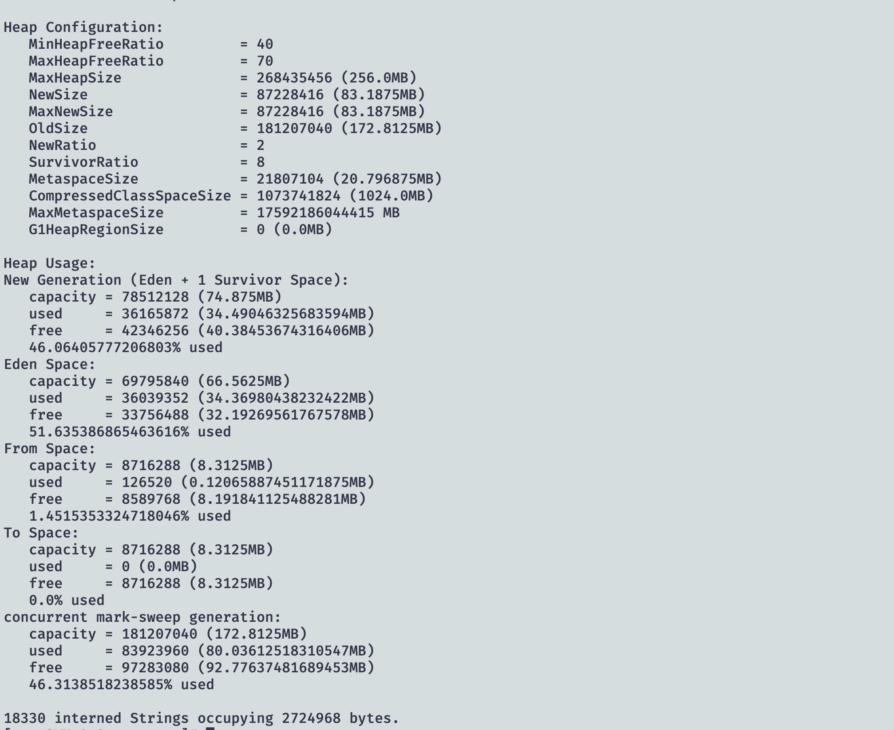
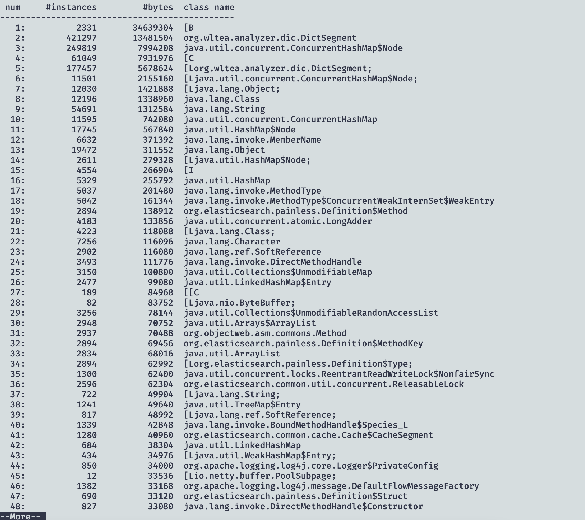

1. jps 查看 Java 应用pid

2. 查看当前进程内存分配
   jmap -heap 5118

   

3. jmap -histo:live 5118

   ```
   5118: well-known file /tmp/.java_pid5118 is not secure: file should be owned by the current user (which is 0) but is owned by 994
   ```

   报错原因是该进程的用户不是root用户
   查询当前进程的用户

   ```
   ps -ef | grep 5118
   ```

   输出：

   ```
   elastic+  5118     1  0 Dec10 ?        00:37:57 /usr/lib/jvm/java-1.8.0-openjdk-1.8.0.262.b10-0.el7_8.x86_64/bin/java -Xms256M -Xmx256M -XX:+UseConcMarkSweepGC -XX:CMSInitiatingOccupancyFraction=75 -XX:+UseCMSInitiatingOccupancyOnly -XX:+AlwaysPreTouch -server -Xss1m -Djava.awt.headless=true -Dfile.encoding=UTF-8 -Djna.nosys=true -Djdk.io.permissionsUseCanonicalPath=true -Dio.netty.noUnsafe=true -Dio.netty.noKeySetOptimization=true -Dio.netty.recycler.maxCapacityPerThread=0 -Dlog4j.shutdownHookEnabled=false -Dlog4j2.disable.jmx=true -Dlog4j.skipJansi=true -XX:+HeapDumpOnOutOfMemoryError -Des.path.home=/usr/share/elasticsearch -cp /usr/share/elasticsearch/lib/* org.elasticsearch.bootstrap.Elasticsearch -p /var/run/elasticsearch/elasticsearch.pid --quiet -Edefault.path.logs=/var/log/elasticsearch -Edefault.path.data=/var/lib/elasticsearch -Edefault.path.conf=/etc/elasticsearch
   root     25577 17968  0 23:28 pts/1    00:00:00 grep --color=auto 5118
   ```

   可以看出用户是叫 elastic+ 为什么会有个➕？ 猜测是省略了

   碰碰运气使用 elasticsearch 

   ```
   sudo -u elasticsearch jmap -histo:live 5118 | more
   ```

   

4. 参数解读
   序号     实例数    所占内存大小 类名

   ```
   [Z = boolean
   [B = byte
   [S = short
   [I = int
   [J = long
   [F = float
   [D = double
   [C = char
   [L = any non-primitives(Object)
   ```

   

