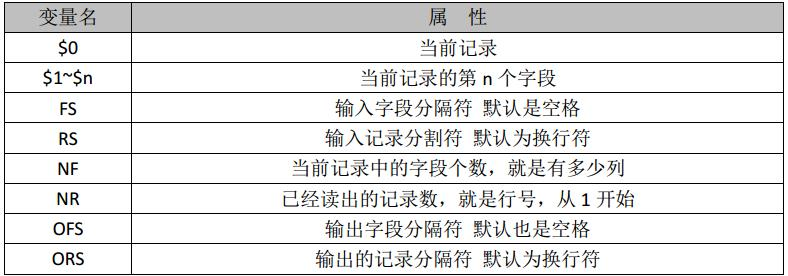
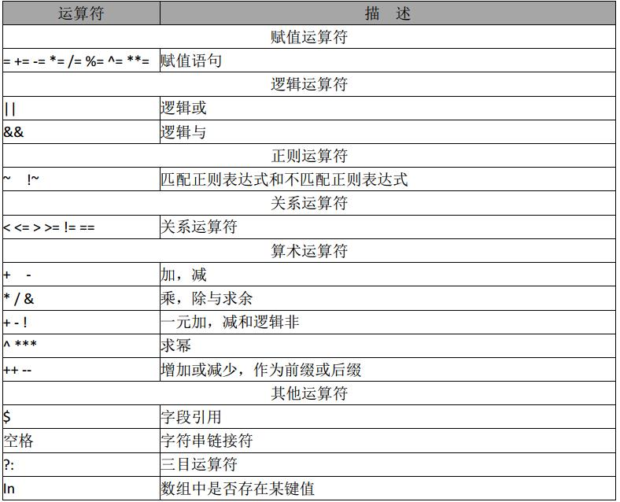
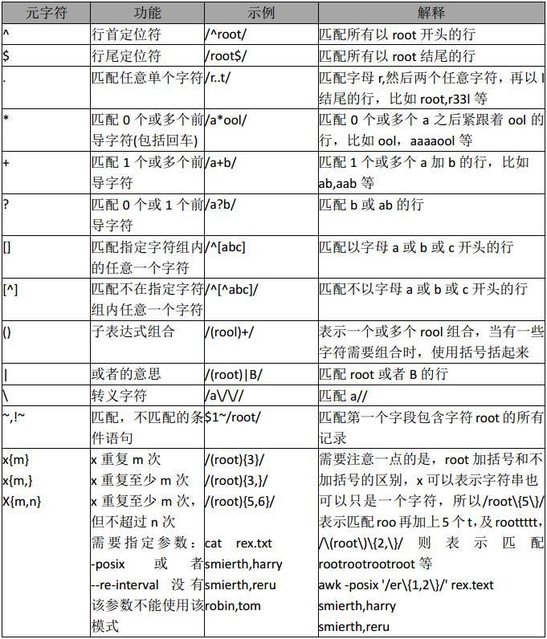
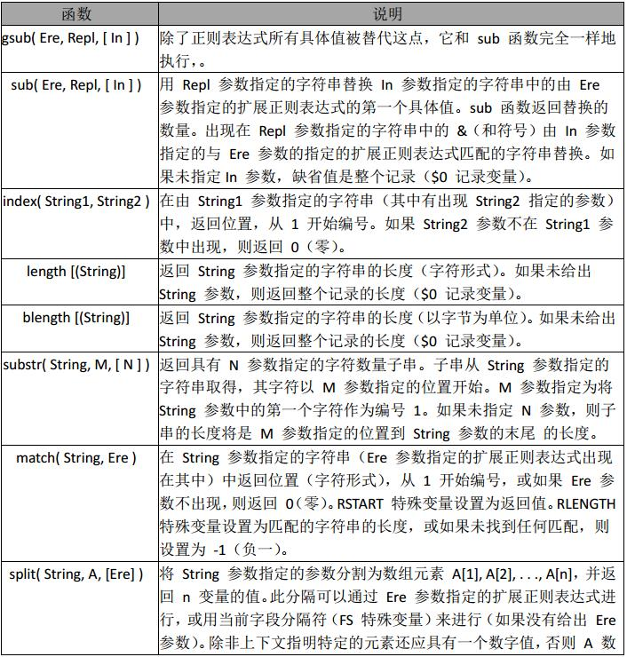

### awk简介

awk其名称得自于它的创始人 Alfred Aho 、Peter Weinberger 和 Brian Kernighan 姓氏的首个字母。实际上 AWK 的确拥有自己的语言： AWK 程序设计语言 ， 三位创建者已将它正式定义为“样式扫描和处理语言”。它允许您创建简短的程序，这些程序读取输入文件、为数据排序、处理数据、对输入执行计算以及生成报表，还有无数其他的功能。

awk 是一种很棒的语言，它适合文本处理和报表生成，其语法较为常见，借鉴了某些语言的一些精华，如 C 语言等。在 linux 系统日常处理工作中，发挥很重要的作用，掌握了 awk将会使你的工作变的高大上。 awk 是三剑客的老大，利剑出鞘，必会不同凡响。


### **使用方法**

```
awk '{pattern + action}' {filenames}

注意点 awk 默认分隔符为空格

-F 指定分隔符  支持正则
$n 只分隔之后的字符串 从1开始 $0 指整个字符串

awk -F'[ ,]+' '{print $7}' test.txt

awk '{if(NR>=20 && NR<=30) print $1}' test.txt  

NR指行数
```


### BEGIN 和 END 模块

通常，对于每个输入行， awk 都会执行每个脚本代码块一次。然而，在许多编程情况中，可能需要在 awk 开始处理输入文件中的文本之前执行初始化代码。对于这种情况， awk 允许您定义一个 BEGIN 块。

因为 awk 在开始处理输入文件之前会执行 BEGIN 块，因此它是初始化 FS（字段分隔符）变量、打印页眉或初始化其它在程序中以后会引用的全局变量的极佳位置。
awk 还提供了另一个特殊块，叫作 END 块。 awk 在处理了输入文件中的所有行之后执行这个块。通常， END 块用于执行最终计算或打印应该出现在输出流结尾的摘要信息。

> 个人理解：
>
> BEGIN ： 开始前执行
>
> END：结束前执行


```
awk '{count++;print $0;} END{print "user count is ",count}' passwd

ll |awk 'BEGIN {size=0;} {size=size+$5;} END{print "[end]size is ",size}'

ll |awk 'BEGIN{size=0;} {size=size+$5;} END{print "[end]size is ",size/1024/1024,"M"}'  

### 逻辑运算符
awk 'BEGIN{a=1;b=2;print (a>2&&b>1,a=1||b>1)}'

### 关系运算符
> < 可以作为字符串比较，也可以用作数值比较，关键看操作数如果是字符串就会转换为字符串比较。两个都为数字 才转为数值比较。字符串比较：按照ascii码顺序比较

### awk 算术运算符
说明，所有用作算术运算符进行操作，操作数自动转为数值，所有非数值都变为0


awk -F ":" 'NF==8{print $0}' hello.txt

### awk正则运算符
awk 'BEGIN{a="100testaa";if(a~/100/) {print "ok"}}'
/正则正文/
```






###  awk 正则




```
awk '/root/{print $0}' passwd ##匹配所有包含root的行

awk -F: '$5~/root/{print $0}' passwd  ## 以分号作为分隔符，匹配第5个字段是root的行


### 布尔表达式
awk -F: '$1=="root"{print $0}' passwd

awk -F: '($1=="root")&&($5=="root") {print $0}' passwd


```


### awk 的 if、循环和数组

```
{
        if ($1=="foo"){
                if($2=="foo"){
                        print "uno"
                }else{
                        print "one"
                }
        }elseif($1=="bar"){
                print "two"
        }else{
                print "three"
        }
}
```


if替换正则

```
! /matchme/ { print $1 $3 $4 }


{
　　if ( $0 !~ /matchme/ ) {
　　　　print $1 $3 $4
　　}
}
```


#### 循环结构

我们已经看到了 awk 的 while 循环结构，它等同于相应的 C 语言 while 循环。 awk 还有"do...while"循环，它在代码块结尾处对条件求值，而不像标准 while 循环那样在开始处求值。

它类似于其它语言中的"repeat...until"循环。以下是一个示例：
do...while 示例


```
{
    count=1do {
        print "I get printed at least once no matter what"
    } while ( count !=1 )
}
```


与一般的 while 循环不同，由于在代码块之后对条件求值， "do...while"循环永远都至少执行一次。换句话说，当第一次遇到普通 while 循环时，如果条件为假，将永远不执行该循环。

#### for 循环

awk 允许创建 for 循环，它就象 while 循环，也等同于 C 语言的 for 循环：

```
for ( initial assignment; comparison; increment ) {
    code block
}

### 栗子
for ( x=1;x<=4;x++ ) {
    print "iteration", x
}
```

#### break 和 continue

此外，如同 C 语言一样， awk 提供了 break 和 continue 语句。使用这些语句可以更好地控制 awk 的循环结构。以下是迫切需要 break 语句的代码片断：

```
while 死循环
while (1) {
print "forever and ever..."
}
while 死循环 1 永远代表是真，这个 while 循环将永远运行下去。
```

以下是一个只执行十次的循环：

```
#break 语句示例
x=1
while(1) {
　　print "iteration", x
　　if ( x==10 ) {
　　　　break
　　}
　　x++
}
```

这里， break 语句用于“逃出”最深层的循环。 "break"使循环立即终止，并继续执行循环代码块后面的语句。
continue 语句补充了 break，其作用如下：

```
x=1 while (1) {
        if ( x==4 ) {
        x++
        continue
    }
    print "iteration", x
    if ( x>20 ) {
        break
    }
    x++
}
```

这段代码打印"iteration1"到"iteration21"， "iteration4"除外。如果迭代等于 4，则增加 x并调用 continue 语句，该语句立即使 awk 开始执行下一个循环迭代，而不执行代码块的其余部分。如同 break 一样，

continue 语句适合各种 awk 迭代循环。在 for 循环主体中使用时， continue 将使循环控制变量自动增加。以下是一个等价循环：

```
for ( x=1;x<=21;x++ ) {
    if ( x==4 ) {
        continue
    }
    print "iteration", x
}
```


在while 循环中时，在调用 continue 之前没有必要增加 x，因为 for 循环会自动增加 x。

#### 数组 

AWK 中的数组都是关联数组,数字索引也会转变为字符串索引

```
{
    cities[1]=”beijing”
    cities[2]=”shanghai”
    cities[“three”]=”guangzhou”
    for( c in cities) {
        print cities[c]
    }
    print cities[1]
    print cities[“1”]
    print cities[“three”]
}
```


for…in 输出，因为数组是关联数组，默认是无序的。所以通过 for…in 得到是无序的数组。如果需要得到有序数组，需要通过下标获得。

#### 数组的典型应用

用 awk 中查看服务器连接状态并汇总

```
netstat -an|awk '/^tcp/{++s[$NF]}END{for(a in s)print a,s[a]}'
ESTABLISHED 1
LISTEN 20
```


统计 web 日志访问流量，要求输出访问次数，请求页面或图片，每个请求的总大小，总访问流量的大小汇总

```
awk '{a[$7]+=$10;++b[$7];total+=$10}END{for(x in a)print b[x],x,a[x]|"sort -rn -k1";print
"total size is :"total}' /app/log/access_log
total size is :172230
21 /icons/poweredby.png 83076
14 / 70546
8 /icons/apache_pb.gif 18608
a[$7]+=$10 表示以第 7 列为下标的数组（ $10 列为$7 列的大小），把他们大小累加得到
$7 每次访问的大小，后面的 for 循环有个取巧的地方， a 和 b 数组的下标相同，所以一
条 for 语句足矣
```


### 常用字符串函数

#### 字符串函数的应用 

替换

```
awk 'BEGIN{info="this is a test2010test!";gsub(/[0-9]+/,"!",info);print info}' this is a test!test!
在 info 中查找满足正则表达式， /[0-9]+/ 用”!”替换，并且替换后的值，赋值给 info 未
给 info 值，默认是$0
```


查找

```
awk 'BEGIN{info="this is a test2010test!";print index(info,"test")?"ok":"no found";}'
ok #未找到，返回 0
```


匹配查找

```
awk 'BEGIN{info="this is a test2010test!";print match(info,/[0-9]+/)?"ok":"no found";}'
ok #如果查找到数字则匹配成功返回 ok，否则失败，返回未找到
```


截取

```
awk 'BEGIN{info="this is a test2010test!";print substr(info,4,10);}'
s is a tes #从第 4 个 字符开始，截取 10 个长度字符串
```


分割

```
awk 'BEGIN{info="this is a test";split(info,tA," ");print length(tA);for(k in tA){print k,tA[k];}}' 4
4 test 1 this 2 is 3 a
#分割 info,动态创建数组 tA,awk for …in 循环，是一个无序的循环。 并不是从数组下标
1…n 开始
```





