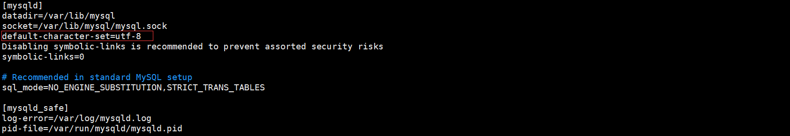

linux下安装MYSQL

```java
### 检查是否安装过mysql
rpm -qa | grep mysql

### 如果安装过 执行删除命令
rpm -e --nodeps mysql-libs-5.1.73-5.el6_6.x86_64

### 查找旧目录
whereis mysql
find / -name mysql

## 删除相关目录
rm -rf /usr/bin/mysql

### 使用yum安装mysql
yum install mysql

### 安装服务端
yum install mysql-server

### 报错
Loaded plugins: fastestmirror, langpacks
Loading mirror speeds from cached hostfile
No package mysql-server available.
Error: Nothing to do

原因：CentOS7自带有MariaDB而不是MySQL，MariaDB和MySQL一样也是开源的数据库

解决方案：如果必须要安装MySQL，首先必须添加mysql社区repo通过输入命令：sudo rpm -Uvh http://dev.mysql.com/get/mysql-community-release-el7-5.noarch.rpm

重新执行：yum install mysql-server 

yum install mysql-devel

到此mysql数据库安装完成了,接下来需要对数据库进行一些简单配置

在/etc/my.cnf 文件中加入默认字符集

vim /etc/my.cnf
```




启动或关闭mysql服务

```
service mysqld start      --启动mysql
service mysqld stop       --关闭mysql·
lsof -i:3306              --数据库端口是否开启
### 没有初始化表执行
mysql_install_db --user=mysql --basedir=/usr/ --ldata=/var/lib/mysql/
```


设置开机启动mysql服务

```
chkconfig --add mysqld   
```


创建root管理员

```
mysqladmin -u root password 123456
```


进入mysql容器中

```
mysql -u root -p   
```


mysql增加权限：mysql库中的user表新增一条记录host为“%”，user为“root”

```
use mysql;

UPDATE user SET `Host` = '%' WHERE `User` = 'root' LIMIT 1;
```


开放防火墙端口,允许外部访问

 a、修改防火墙配置 

```
vi /etc/sysconfig/iptables

加入：-A INPUT -p tcp -m tcp --dport 3306 -j ACCEPT 这段配置，然后进行保存
```


iptables基本命令

```
systemctl restart iptables.service      -- 重启防火墙
systemctl status iptables.service       -- 查看状态
service iptables save                   -- 保存规则
systemctl enable iptables.service       -- 设置开机启动
systemctl start iptables.service        -- 开启服务
```


完成后启动不了，解决方法 指定dbuser

```
mysql_install_db --user=mysql --datadir=/var/lib/mysql
```


授权远程访问数据库

进入mysql界面运行

GRANT ALL PRIVILEGES ON *.* TO 'root'@'%' IDENTIFIED BY '123456' WITH GRANT OPTION;