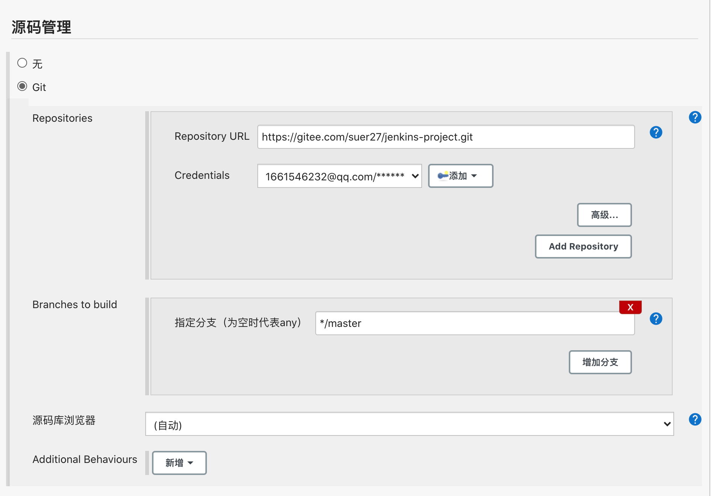
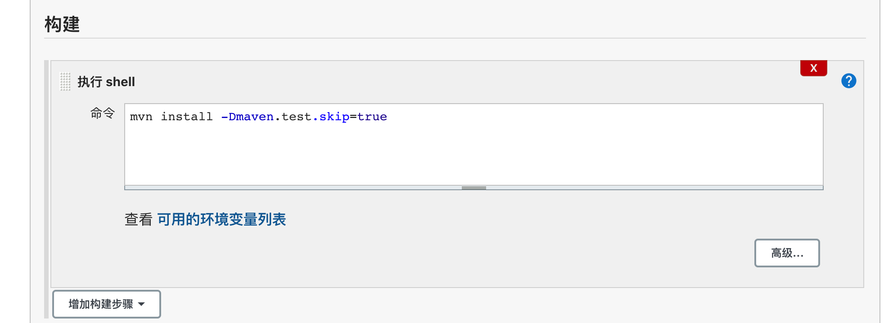
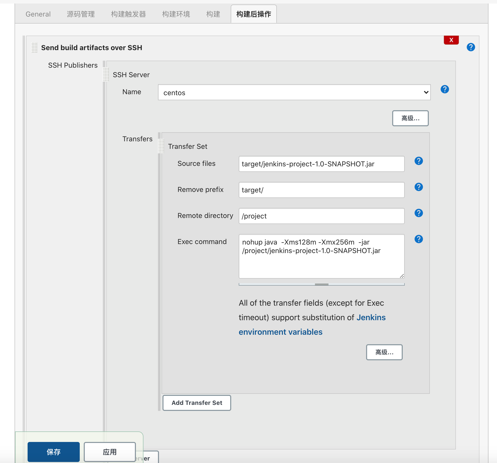

## 1.使用yum 安装jenkins

不知道为什么，第一次安装可以第二次下载老是下载不下来

```
### 下载包
wget -O /etc/yum.repos.d/jenkins.repo https://pkg.jenkins.io/redhat/jenkins.repo

### 查看包
cat /etc/yum.repos.d/jenkins.repo 

### 安装jenkins key
rpm --import https://pkg.jenkins.io/redhat/jenkins.io.key

### 安装jenkins
yum install -y jenkins

### 启动
systemctl start jenkins

### 后续启动/停止/重启
service jenkins start/stop/restart


```


## 2.Jenkins 使用国内镜像快速安装（rpm安装）

国内镜像安装

```
### 下载镜像
wget https://mirrors.tuna.tsinghua.edu.cn/jenkins/redhat-stable/jenkins-2.204.3-1.1.noarch.rpm

### sudo yum install jenkins-2.204.3-1.1.noarch.rpm
```

这个版本貌似不是最新，老是提示有新版本


## 3.Jenkins配置文件

 ```
vim /etc/sysconfig/jenkins
 ```

可进行端口号以及用户修改

端口号默认 8080


## 4.第一次登陆需要密码

```
cat /var/lib/jenkins/secrets/initialAdminPassword
```


## 5.修改镜像源 后续下载插件能用到

```
vim /var/lib/jenkins/hudson.model.UpdateCenter.xml
```

将 url 修改为 清华大学官方镜像：https://mirrors.tuna.tsinghua.edu.cn/jenkins/updates/update-center.json


## 6.程序主目录

```
# ls /var/lib/jenkins/				#查看程序主目录
config.xml                                      nodes
hudson.model.UpdateCenter.xml                   plugins
hudson.plugins.git.GitTool.xml                  queue.xml.bak
identity.key.enc                                secret.key
jenkins.CLI.xml                                 secret.key.not-so-secret
jenkins.install.InstallUtil.lastExecVersion     secrets
jenkins.install.UpgradeWizard.state             updates
jenkins.model.JenkinsLocationConfiguration.xml  userContent
jobs                                            users
logs                                            workflow-libs
nodeMonitors.xml
```


## 7.关键目录

```
jobs		浏览器上面创建的任务都会存放在这里

logs		存放jenkins相关的日志

nodes		多节点时用到

plugins		插件所在目录

secrets		密码秘钥所在目录
```

jenkins存放数据不依靠数据库，所以在移植时只需要拷贝整个程序主目录即可


## 8.开始进行第一次构建


### (1)插件安装

 检查是否有“Git plugin”和“Publish over SSH”两个插件，如果没有，在“可选插件”中安装


### (2)生成连接发布服务器的秘钥

```
### 生成名叫jenkins的私钥和公钥
ssh-keygen -f ~/.ssh/jenkins

### 查看私钥
cat jenkins
```

`系统管理`–>`系统设置`，找到之前安装的`Publish over SSH`插件，

`Passphrase`填写之前生成秘钥时设置的密码，没有则留空，

`Path to key`留空，

`Key`粘贴`/root/.ssh/jenkins`文件内容


然后新增`SSH Servers`，填入对应的hostname，这就是PHP代码要发布的机器

Name ：随便起 用于标识

HostName : ip地址

Username：root （部署的那台机器的用户）

Remote Directory：部署的那台机器路径  一般用 /

接下来还需要把公钥拷贝到对应的hostname机器上

```
### 查看公钥
cat jenkins.pub

### 将公钥写到对应的文件
cd ~/.ssh/
vim authorized_keys

```

浏览器上测试连接有没有问题，点击`Test Configuration`，如果没问题，左侧会显示Success


### (3) 创建项目进行构建

点击`创建一个新任务`，自定义任务名称，选择`构建一个自由风格的软件项目`

源码管理 ： 







