# ***\*二\****  ***\*全文检索工具elasticsearch\****

## ***\*1\****  ***\*lucene与elasticsearch\****

咱们之前讲的处理分词，构建倒排索引，等等，都是这个叫lucene的做的。那么能不能说这个lucene就是搜索引擎呢？

还不能。lucene只是一个提供全文搜索功能类库的核心工具包，而真正使用它还需要一个完善的服务框架搭建起来的应用。

好比lucene是类似于jdk，而搜索引擎软件就是tomcat 的。

目前市面上流行的搜索引擎软件，主流的就两款，elasticsearch和solr,这两款都是基于lucene的搭建的，可以独立部署启动的搜索引擎服务软件。由于内核相同，所以两者除了服务器安装、部署、管理、集群以外，对于数据的操作，修改、添加、保存、查询等等都十分类似。就好像都是支持sql语言的两种数据库软件。只要学会其中一个另一个很容易上手。

从实际企业使用情况来看，elasticSearch的市场份额逐步在取代solr，国内百度、京东、新浪都是基于elasticSearch实现的搜索功能。国外就更多了 像维基百科、GitHub、Stack Overflow等等也都是基于ES的

 

## ***\*2\****  ***\*elasticSearch的使用场景\****

1、 为用户提供按关键字查询的全文搜索功能。

2、 著名的ELK框架(ElasticSearch,Logstash,Kibana)，实现企业海量日志的处理分析的解决方案。大数据领域的重要一份子。

## ***\*3\****  ***\*elasticSearch的安装\****

***\*详见《elasticSearch的安装手册》\****

 

 

## ***\*4\****  ***\*e\*******\*lasticsearch\*******\*的基本概念\****

| cluster  | 整个elasticsearch 默认就是集群状态，整个集群是一份完整、互备的数据。 |
| -------- | ------------------------------------------------------------ |
| node     | 集群中的一个节点，一般只一个进程就是一个node                 |
| shard    | 分片，即使是一个节点中的数据也会通过hash算法，分成多个片存放，默认是5片。 |
| index    | 相当于rdbms的database, 对于用户来说是一个逻辑数据库，虽然物理上会被分多个shard存放，也可能存放在多个node中。 |
| type     | 类似于rdbms的table，但是与其说像table，其实更像面向对象中的class , 同一Json的格式的数据集合。 |
| document | 类似于rdbms的 row、面向对象里的object                        |
| field    | 相当于字段、属性                                             |

 

 

## ***\*5\****  ***\*利用ki\*******\*b\*******\*ana学习 elasti\*******\*csearch restful api (DSL)\****

### ***\*5\*******\*.1\****  ***\*es中保存的数据结构\****

public class  Movie {	 String id;   String name;   Double doubanScore;   List<Actor> actorList;} public class Actor{String id;String name;}

这两个对象如果放在关系型数据库保存，会被拆成2张表，但是elasticsearch是用一个json来表示一个document。

所以他保存到es中应该是：

{ “id”:”1”, “name”:”operation red sea”, “doubanScore”:”8.5”, “actorList”:[  {“id”:”1”,”name”:”zhangyi”},{“id”:”2”,”name”:”haiqing”},{“id”:”3”,”name”:”zhanghanyu”}]}

 

### ***\*5\*******\*.2 对数据的操作\****

#### ***\*5\*******\*.2.1 查看es中有哪些索引\****

GET /_cat/indices?v

es 中会默认存在一个名为.kibana的索引

表头的含义

| health         | green(集群完整) yellow(单点正常、集群不完整) red(单点不正常) |
| -------------- | ------------------------------------------------------------ |
| status         | 是否能使用                                                   |
| index          | 索引名                                                       |
| uuid           | 索引统一编号                                                 |
| pri            | 主节点几个                                                   |
| rep            | 从节点几个                                                   |
| docs.count     | 文档数                                                       |
| docs.deleted   | 文档被删了多少                                               |
| store.size     | 整体占空间大小                                               |
| pri.store.size | 主节点占                                                     |

 

#### ***\*5\*******\*.2.2 增加一个索引\****

PUT /movie_index

#### ***\*5\*******\*.2.3 删除一个索引\****

   ES 是不删除也不修改任何数据

DELETE /movie_index

#### ***\*5\*******\*.2.4 新增文档\**** 

1、 格式 PUT /index/type/id

```json
{ "id":1, "name":"operation red sea", "doubanScore":8.5, "actorList":[  {"id":1,"name":"zhang yi"},{"id":2,"name":"hai qing"},{"id":3,"name":"zhang han yu"}]}PUT /movie_index/movie/2{ "id":2, "name":"operation meigong river", "doubanScore":8.0, "actorList":[  {"id":3,"name":"zhang han yu"}]} PUT /movie_index/movie/3{ "id":3, "name":"incident red sea", "doubanScore":5.0, "actorList":[  {"id":4,"name":"zhang chen"}]}
```


如果之前没建过index或者type，es 会自动创建。

#### ***\5.2.5\*** 直接用id查找\***

GET movie_index/movie/1

 

#### ***\*5.2.6\**** ***\*修改\*******\*—\*******\*整体替换\**** 

和新增没有区别

PUT /movie_index/movie/3{ "id":"3", "name":"incident red sea", "doubanScore":"5.0", "actorList":[  {"id":"1","name":"zhang chen"}]}

 

#### ***\*5.2.7\*******\*修改\*******\*—\*******\*某个字段\****

POST movie_index/movie/3/_update{  "doc": {  "doubanScore":"7.0" } }

 

#### ***\*5\*******\*.2.8 删除一个document\****

DELETE movie_index/movie/3

 

#### ***\*5\*******\*.2.9 搜索type全部数据\****

GET movie_index/movie/_search

结果

{ "took": 2,   //耗费时间 毫秒 "timed_out": false, //是否超时 "_shards": {  "total": 5,  //发送给全部5个分片  "successful": 5,  "skipped": 0,  "failed": 0 }, "hits": {  "total": 3,  //命中3条数据  "max_score": 1,  //最大评分  "hits": [  // 结果   {    "_index": "movie_index",    "_type": "movie",    "_id": 2,    "_score": 1,    "_source": {     "id": "2",     "name": "operation meigong river",     "doubanScore": 8.0,     "actorList": [      {       "id": "1",       "name": "zhang han yu"      }     ]    }     。。。。。。。。     。。。。。。。。   }

 

#### ***\*5\*******\*.2.10 按条件查询(全部)\****

GET movie_index/movie/_search{ "query":{  "match_all": {} }}

#### ***\*5\*******\*.2.11 按分词查询\**** 

GET movie_index/movie/_search{ "query":{  "match": {"name":"red"} }}

注意结果的评分

 

#### ***\*5\*******\*.2.12 按分词子属性查询\**** 

GET movie_index/movie/_search{ "query":{  "match": {"actorList.name":"zhang"} }}

 

#### ***\*5.2.13\****  ***\*match phrase\****

GET movie_index/movie/_search{  "query":{   "match_phrase": {"name":"operation red"}  }}

按短语查询，不再利用分词技术，直接用短语在原始数据中匹配

 

#### ***\*5.2.14\****  ***\*fuzzy查询\****

GET movie_index/movie/_search{  "query":{   "fuzzy": {"name":"rad"}  }}

校正匹配分词，当一个单词都无法准确匹配，es通过一种算法对非常接近的单词也给与一定的评分，能够查询出来，但是消耗更多的性能。

 

#### ***\*5\*******\*.2.15\**** ***\*过滤--查询后过滤\****

GET movie_index/movie/_search{  "query":{   "match": {"name":"red"}  },  "post_filter":{   "term": {    "actorList.id": 3   }  }}

 

#### ***\*5\*******\*.2.16 过滤--查询前过滤（推荐）\****

GET movie_index/movie/_search{   "query":{    "bool":{     "filter":[ {"term": {  "actorList.id": "1"  }},           {"term": {  "actorList.id": "3"  }}      ],       "must":{"match":{"name":"red"}}     }  }}

 

#### ***\*5\*******\*.2.17 过滤--按范围过滤\****

GET movie_index/movie/_search{  "query": {   "bool": {    "filter": {     "range": {      "doubanScore": {"gte": 8}     }    }   }  }}

关于范围操作符：

| gt   | 大于     |
| ---- | -------- |
| lt   | 小于     |
| gte  | 大于等于 |
| lte  | 小于等于 |

 

 

#### ***\*5\*******\*.2.18  排序\****

GET movie_index/movie/_search{ "query":{  "match": {"name":"red sea"} } , "sort": [  {   "doubanScore": {    "order": "desc"   }  } ]}

 

#### ***\*5\*******\*.2.19 分页查询\****

GET movie_index/movie/_search{ "query": { "match_all": {} }, "from": 1, "size": 1}

 

#### ***\*5\*******\*.2.20 指定查询的字段\****

GET movie_index/movie/_search{ "query": { "match_all": {} }, "_source": ["name", "doubanScore"]}

 

#### ***\*5\*******\*.2.21 高亮\****

GET movie_index/movie/_search{  "query":{   "match": {"name":"red sea"}  },  "highlight": {   "fields": {"name":{} }  }  }  自定义标签GET movie_index/movie/_search{  "query":{   "match": {"name":"red sea"}  },  "highlight": {   "pre_tags": ["<b>"],    "post_tags": ["</b>"],    "fields": {"name":{} }  }  }

 

 

#### ***\*5\*******\*.2.22 聚合\****

取出每个演员共参演了多少部电影

GET movie_index/movie/_search{  "aggs": {  "groupby_actor": {   "terms": {    "field": "actorList.name.keyword"     }  }  }}

 

每个演员参演电影的平均分是多少，并按评分排序

GET movie_index/movie/_search{  "aggs": {  "groupby_actor_id": {   "terms": {    "field": "actorList.name.keyword" ,    "order": {     "avg_score": "desc"     }   },   "aggs": {    "avg_score":{     "avg": {      "field": "doubanScore"      }    }    }  }  }}

 

 

### ***\*5\*******\*.3 关于mapping\****

之前说type可以理解为table，那每个字段的数据类型是如何定义的呢

查看看mapping

GET movie_index/_mapping/movie

实际上每个type中的字段是什么数据类型，由mapping定义。

但是如果没有设定mapping系统会自动，根据一条数据的格式来推断出应该的数据格式。

l true/false → boolean

l 1020  → long

l 20.1 → double

l “2018-02-01” → date

l “hello world” → text +keyword

默认只有text会进行分词，keyword是不会分词的字符串。

mapping除了自动定义，还可以手动定义，但是只能对新加的、没有数据的字段进行定义。一旦有了数据就无法再做修改了。

注意：虽然每个Field的数据放在不同的type下,但是同一个名字的Field在一个index下只能有一种mapping定义。

 

 

### ***\*5\*******\*.4 中文分词\****

elasticsearch本身自带的中文分词，就是单纯把中文一个字一个字的分开，根本没有词汇的概念。但是实际应用中，用户都是以词汇为条件，进行查询匹配的，如果能够把文章以词汇为单位切分开，那么与用户的查询条件能够更贴切的匹配上，查询速度也更加快速。

分词器下载网址：https://github.com/medcl/elasticsearch-analysis-ik

 

#### ***\*5\*******\*.4.1 安装\****

下载好的zip包，请解压后放到 /usr/share/elasticsearch/plugins/ik

 

然后重启es

#### ***\*5\*******\*.4.2测试使用\****

使用默认

GET movie_index/_analyze{   "text": "我是中国人"}

  请观察结果

 使用分词器

GET movie_index/_analyze{  "analyzer": "ik_smart",  "text": "我是中国人"}

​	请观察结果

  另外一个分词器

  ik_max_word

GET movie_index/_analyze{  "analyzer": "ik_max_word",  "text": "我是中国人"}

  

 

 

 

 

请观察结果

 

能够看出不同的分词器，分词有明显的区别，所以以后定义一个type不能再使用默认的mapping了，要手工建立mapping, 因为要选择分词器。

 

#### ***\*5\*******\*.4.3基于中文分词搭建索引\****

1、建立mapping

PUT movie_chn{ "mappings": {  "movie_type_chn":{   "properties": {    "id":{     "type": "long"    },    "name":{     "type": "text"     , "analyzer": "ik_smart"    },    "doubanScore":{     "type": "double"    },    "actorList":{     "properties": {      "id":{       "type":"long"      },      "name":{       "type":"keyword"      }     }    }   }  } }}

 

插入数据

PUT /movie_chn/movie_type_chn/1{ "id":1, "name":"红海行动", "doubanScore":8.5, "actorList":[   {"id":1,"name":"张译"}, {"id":2,"name":"海清"}, {"id":3,"name":"张涵予"} ]}PUT /movie_chn/movie_type_chn/2{ "id":2, "name":"湄公河行动", "doubanScore":8.0, "actorList":[  {"id":3,"name":"张涵予"}]} PUT /movie_chn/movie_type_chn/3{ "id":3, "name":"红海事件", "doubanScore":5.0, "actorList":[  {"id":4,"name":"张晨"}]}

 

 

查询测试

GET /movie_chn/movie_type_chn/_search{ "query": {  "match": {   "name": "红海战役"  } }} GET /movie_chn/movie_type_chn/_search{ "query": {  "term": {   "actorList.name": "张译"  } }}

 

 

#### ***\*5.4.4 自定义词库\****

修改/usr/share/elasticsearch/plugins/ik/config/中的IKAnalyzer.cfg.xml

<?xml version="1.0" encoding="UTF-8"?><!DOCTYPE properties SYSTEM "http://java.sun.com/dtd/properties.dtd"><properties>    <comment>IK Analyzer 扩展配置</comment>    <!--用户可以在这里配置自己的扩展字典 -->    <entry key="ext_dict"></entry>     <!--用户可以在这里配置自己的扩展停止词字典-->    <entry key="ext_stopwords"></entry>    <!--用户可以在这里配置远程扩展字典 -->     <entry key="remote_ext_dict">http://192.168.67.163/fenci/myword.txt</entry>    <!--用户可以在这里配置远程扩展停止词字典-->    <!-- <entry key="remote_ext_stopwords">words_location</entry> --></properties>

 

 

按照标红的路径利用nginx发布静态资源

在nginx.conf中配置

 server {    listen  80;    server_name  192.168.67.163;    location /fenci/ {      root es;  }  }

 

并且在/usr/local/nginx/下建/es/fenci/目录，目录下加myword.txt

myword.txt中编写关键词，每一行代表一个词。

 

然后重启es服务器，重启nginx。

在kibana中测试分词效果

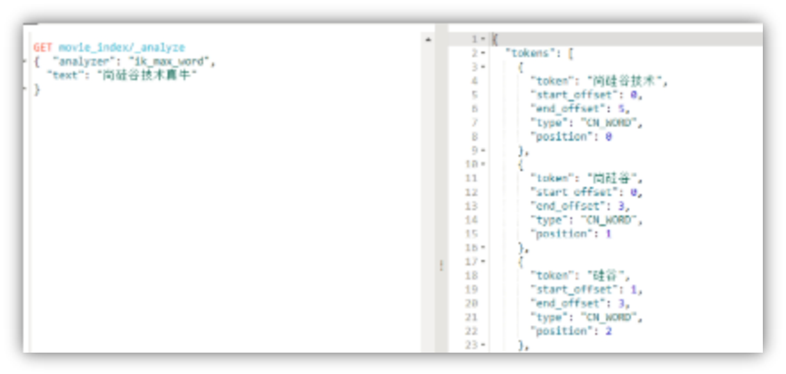 

更新完成后，es只会对新增的数据用新词分词。历史数据是不会重新分词的。如果想要历史数据重新分词。需要执行：

POST movies_index_chn/_update_by_query?conflicts=proceed

 

 

 

 

## ***\*三  Java程序中的应用\****

### ***\*1 、搭建模块\****

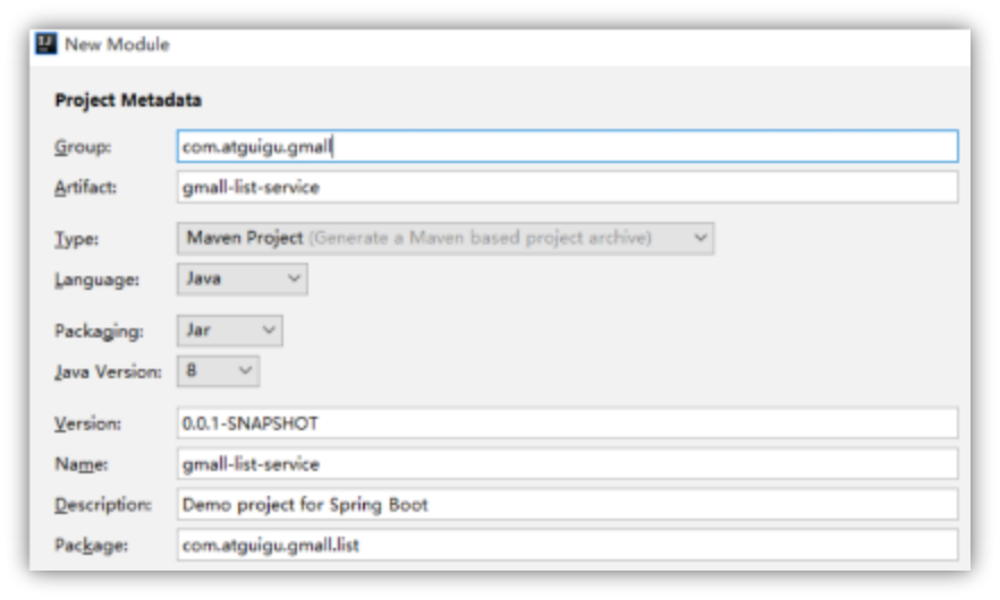 

 

 

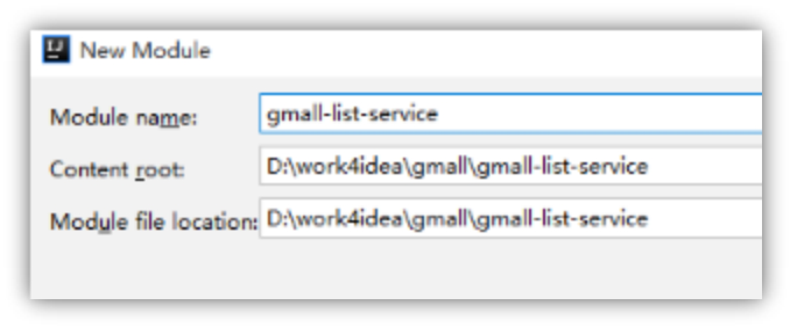 

pom.xml

**原版****<?**xml version="1.0" encoding="UTF-8"**?>**** **<project xmlns="http://maven.apache.org/POM/4.0.0" xmlns:xsi="http://www.w3.org/2001/XMLSchema-instance"   xsi:schemaLocation="http://maven.apache.org/POM/4.0.0 http://maven.apache.org/xsd/maven-4.0.0.xsd">   <modelVersion>4.0.0</modelVersion>    <groupId>com.atguigu.gmall</groupId>   <artifactId>gmall-list-service</artifactId>   <version>0.0.1-SNAPSHOT</version>   <packaging>jar</packaging>    <name>gmall-list-service</name>   <description>Demo project for Spring Boot</description>    <parent>    <groupId>com.atguigu.gmall</groupId>    <artifactId>gmall-parent</artifactId>    <version>1.0-SNAPSHOT</version>   </parent>   <dependencies>     <dependency>      <groupId>com.atguigu.gmall</groupId>      <artifactId>gmall-interface</artifactId>      <version>1.0-SNAPSHOT</version>    </dependency>     <dependency>      <groupId>com.atguigu.gmall</groupId>      <artifactId>gmall-service-util</artifactId>      <version>1.0-SNAPSHOT</version>    </dependency>    </dependencies>    <build>    <plugins>      <plugin>       <groupId>org.springframework.boot</groupId>       <artifactId>spring-boot-maven-plugin</artifactId>      </plugin>    </plugins>   </build>   </project> 修改版本**<?*****\*xml version\*******\*="1.0"\**** ***\*encoding\*******\*="UTF-8"\******?>**** **<***\*project\**** ***\*xmlns\*******\*="http://maven.apache.org/POM/4.0.0"\**** ***\*xmlns:\*******\*xsi\*******\*="http://www.w3.org/2001/XMLSchema-instance"\*******\* \****  ***\*xsi\*******\*:schemaLocation\*******\*="http://maven.apache.org/POM/4.0.0 http://maven.apache.org/xsd/maven-4.0.0.xsd"\****>   <***\*modelVersion\****>4.0.0</***\*modelVersion\****>    <***\*groupId\****>com.atguigu.gmall</***\*groupId\****>   <***\*artifactId\****>gmall-list-service</***\*artifactId\****>   <***\*version\****>0.0.1-SNAPSHOT</***\*version\****>   <***\*packaging\****>jar</***\*packaging\****>    <***\*name\****>gmall-list-service</***\*name\****>   <***\*description\****>Demo project for Spring Boot</***\*description\****>    <***\*parent\****>    <***\*groupId\****>org.springframework.boot</***\*groupId\****>    <***\*artifactId\****>spring-boot-starter-parent</***\*artifactId\****>    <***\*version\****>1.5.15.RELEASE</***\*version\****>    <***\*relativePath\****/> **<!-- lookup parent from repository -->**** **  </***\*parent\****>    <***\*properties\****>    <***\*project.build.sourceEncoding\****>UTF-8</***\*project.build.sourceEncoding\****>    <***\*project.reporting.outputEncoding\****>UTF-8</***\*project.reporting.outputEncoding\****>    <***\*java.version\****>1.8</***\*java.version\****>   </***\*properties\****>    <***\*dependencies\****>    <***\*dependency\****>      <***\*groupId\****>org.springframework.boot</***\*groupId\****>      <***\*artifactId\****>spring-boot-starter</***\*artifactId\****>    </***\*dependency\****>     <***\*dependency\****>      <***\*groupId\****>org.springframework.boot</***\*groupId\****>      <***\*artifactId\****>spring-boot-starter-test</***\*artifactId\****>      <***\*scope\****>test</***\*scope\****>    </***\*dependency\****>    <***\*dependency\****>      <***\*groupId\****>org.springframework.boot</***\*groupId\****>      <***\*artifactId\****>spring-boot-starter-data-elasticsearch</***\*artifactId\****>    </***\*dependency\****>     **<!-- https://mvnrepository.com/artifact/io.searchbox/jest -->**** **   <***\*dependency\****>      <***\*groupId\****>io.searchbox</***\*groupId\****>      <***\*artifactId\****>jest</***\*artifactId\****>      <***\*version\****>5.3.3</***\*version\****>    </***\*dependency\****>    **<!-- https://mvnrepository.com/artifact/net.java.dev.jna/jna -->**** **   <***\*dependency\****>      <***\*groupId\****>net.java.dev.jna</***\*groupId\****>      <***\*artifactId\****>jna</***\*artifactId\****>      <***\*version\****>4.5.1</***\*version\****>    </***\*dependency\****>        <***\*dependency\****>      <***\*groupId\****>junit</***\*groupId\****>      <***\*artifactId\****>junit</***\*artifactId\****>      <***\*version\****>4.12</***\*version\****>    </***\*dependency\****>     <***\*dependency\****>      <***\*groupId\****>org.springframework.boot</***\*groupId\****>      <***\*artifactId\****>spring-boot-test</***\*artifactId\****>      <***\*version\****>1.5.15.RELEASE</***\*version\****>    </***\*dependency\****>      </***\*dependencies\****>    <***\*build\****>    <***\*plugins\****>      <***\*plugin\****>       <***\*groupId\****>org.springframework.boot</***\*groupId\****>       <***\*artifactId\****>spring-boot-maven-plugin</***\*artifactId\****>      </***\*plugin\****>    </***\*plugins\****>   </***\*build\****>   </***\*project\****> 

elasticsearch的 版本号，请提取到gmall-parent中

 

 

### ***\*2、 关于\*******\*es\**** ***\*的java 客户端的选择\****

目前市面上有两类客户端

一类是TransportClient 为代表的ES原生客户端，不能执行原生dsl语句必须使用它的Java api方法。

另外一种是以Rest Api为主的missing client，最典型的就是jest。 这种客户端可以直接使用dsl语句拼成的字符串，直接传给服务端，然后返回json字符串再解析。

两种方式各有优劣，但是最近elasticsearch官网，宣布计划在7.0以后的版本中废除TransportClient。以RestClient为主。

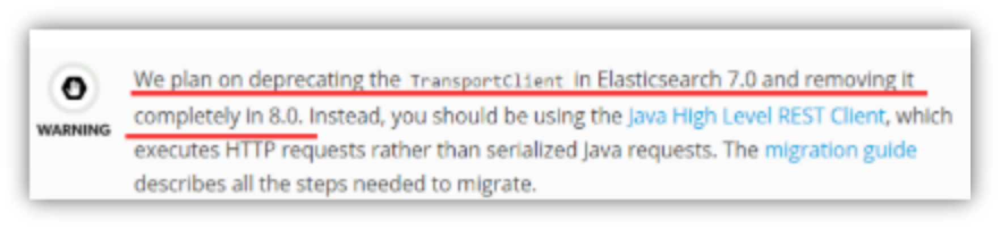 

 所以在官方的RestClient 基础上，进行了简单包装的Jest客户端，就成了首选，而且该客户端也与springboot完美集成。

### ***\*3 、导入Jest依赖\****

<***\*dependency\****>   <***\*groupId\****>org.springframework.boot</***\*groupId\****>   <***\*artifactId\****>spring-boot-starter-data-elasticsearch</***\*artifactId\****> </***\*dependency\****>  **<!-- https://mvnrepository.com/artifact/io.searchbox/jest -->**** **<***\*dependency\****>   <***\*groupId\****>io.searchbox</***\*groupId\****>   <***\*artifactId\****>jest</***\*artifactId\****>   <***\*version\****>5.3.3</***\*version\****> </***\*dependency\****>   **<!-- https://mvnrepository.com/artifact/net.java.dev.jna/jna -->**** **<***\*dependency\****>   <***\*groupId\****>net.java.dev.jna</***\*groupId\****>   <***\*artifactId\****>jna</***\*artifactId\****>   <***\*version\****>4.5.1</***\*version\****> </***\*dependency\****> 

其中jest和jna请将版本号，部分纳入gmall-parent中管理。spring-boot-starter-data-elasticsearch不用管理版本号，其版本跟随springboot的1.5.10大版本号。

### ***\*4 、在测试类中测试ES\****

application.properties中加入

***\*spring.elasticsearch.jest.uris\****=***\*http://192.168.67.163:9200\****

 

测试类

@Autowired JestClient jestClient;  @Test public void testEs() throws IOException {   String query="{\n" +      "  \"query\": {\n" +      "   \"match\": {\n" +      "    \"actorList.name\": \"张译\"\n" +      "   }\n" +      "  }\n" +      "}";   Search search = new Search.Builder(query).addIndex("movie_chn").addType("movie_type_chn").build();    SearchResult result = jestClient.execute(search);    List<SearchResult.Hit<HashMap, Void>> hits = result.getHits(HashMap.class);    for (SearchResult.Hit<HashMap, Void> hit : hits) {    HashMap source = hit.source;    System.**err**.println("source = " + source);    }  } 

打印结果：

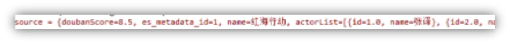 

  以上技术方面的准备就做好了。下面回到咱们电商的业务

 

 

 

 

 

 

 


# ***\*三、利用elasticSearch开发电商的搜索列表功能\****

## ***\*1、功能简介\****

### ***\*1.1入口： 两个\****

首页的分类

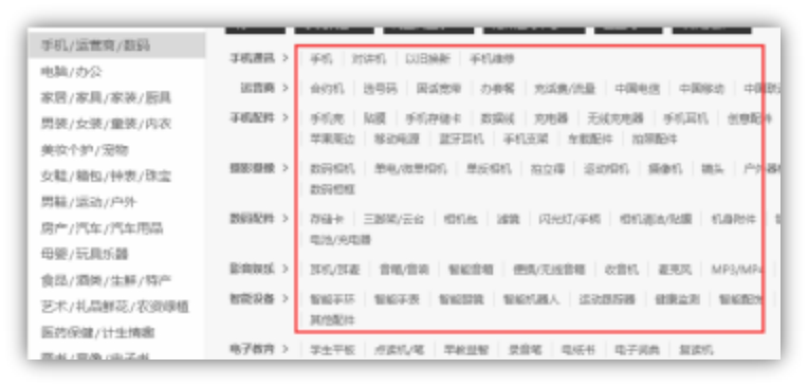 

搜索栏

 

 

 

 

 

 

 

 

### ***\*列表展示页面\****

 

 

 

## ***\*2 根据业务搭建数据结构\****

这时我们要思考三个问题：

1、 哪些字段需要分词

2、 我们用哪些字段进行过滤

3、 哪些字段我们需要通过搜索显示出来。

   

| 需要分词的字段       | sku名称  sku描述         | 分词、定义分词器 |
| -------------------- | ------------------------ | ---------------- |
| 有可能用于过滤的字段 | 平台属性、三级分类、价格 | 要索引           |
| 其他需要显示的字段   | skuId 图片路径           | 不索引           |

 

根据以上制定出如下结构：

PUT gmall{ "mappings": {  "SkuInfo":{   "properties": {    "id":{     "type": "keyword"     , "index": false    },    "price":{     "type": "double"    },     "skuName":{     "type": "text",     "analyzer": "ik_max_word"    },    "skuDesc":{     "type": "text",     "analyzer": "ik_smart"    },    "catalog3Id":{     "type": "keyword"    },    "skuDefaultImg":{     "type": "keyword",     "index": false    },    "skuAttrValueList":{     "properties": {      "valueId":{       "type":"keyword"      }     }    }   }  } }}

 

## ***\*3\**** ***\*sku数据保存到ES\****

思路：

回顾一下，es数据保存的dsl

PUT /movie_index/movie/1{ "id":1, "name":"operation red sea", "doubanScore":8.5, "actorList":[   {"id":1,"name":"zhang yi"}, {"id":2,"name":"hai qing"}, {"id":3,"name":"zhang han yu"} ]}

 

es存储数据是以json格式保存的，那么如果一个javabean的结构刚好跟要求的json格式吻合，我们就可以直接把javaBean序列化为json保持到es中，所以我们要制作一个与es中json格式一致的javabean.

### ***\*3.1  JavaBean\****

skuLsInfo

***\*public class\**** SkuLsInfo ***\*implements\**** Serializable {     String ***\*id\****;    BigDecimal ***\*price\****;    String ***\*skuName\****;    String ***\*skuDesc\****;    String ***\*catalog3Id\****;    String ***\*skuDefaultImg\****;    Long ***\*hotScore\****;    List<SkuLsAttrValue> ***\*skuAttrValueList\****;}

SkuLsAttrValue

***\*public class\**** SkuLsAttrValue ***\*implements\**** Serializable {    String ***\*valueId\****;}

 

### ***\*3.2 保存sku数据的业务实现类\****

 在gmall-list-service模块中增加业务实现类listServiceImpl 

public static final String **index_name_gmall**="gmall";  public static final String **type_name_gmall**="SkuInfo"; public void saveSkuInfo(SkuLsInfo skuLsInfo){   Index index= new Index.Builder(skuLsInfo).index(**index_name_gmall**).type(**type_name_gmall**).id(skuLsInfo.getId()).build();   try {     jestClient.execute(index);   } catch (IOException e) {     e.printStackTrace();   }  } 

自行添加gmall-inteface中增加接口方法

 

 

 

 

### ***\*3.3 在后台管理的sku保存中，调用该方法\****

***\*private void\**** sendSkuToList(SkuInfo skuInfo){    SkuLsInfo skuLsInfo=***\*new\**** SkuLsInfo();    ***\*try\**** {     BeanUtils.**copyProperties**(skuLsInfo, skuInfo);   } ***\*catch\**** (IllegalAccessException e) {     e.printStackTrace();   } ***\*catch\**** (InvocationTargetException e) {     e.printStackTrace();   }   ***\*listService\****.saveSkuInfo(skuLsInfo);  } ***\*public void\**** saveSkuInfo(SkuInfo skuInfo){ …… sendSkuToList(  skuInfo);  //在保存sku最后保存到es} 

 

 

这时在界面中保存sku 是可以，自动向es发送数据的。

 

## ***\*4 查询数据的后台方法\****

### ***\*4.1 分析\****

首先先观察功能页面，咱们一共要用什么查询条件，查询出什么数据？

查询条件： 

1、 关键字

2、 可以通过***\*分类\****进入列表页面

3、 属性值

4、 分页页码

查询结果： 

1  sku的列表(关键字高亮显示)

2 这些sku涉及了哪些属性和属性值

3 命中个数，用于分页

  基于以上

### ***\*4.2 编写DSL语句\*******\*：\****

GET gmall/SkuInfo/_search{ "query": {  "bool": {   "filter": [     {"terms":{ "skuAttrValueList.valueId": ["46","45"]}},     {"term":{"catalog3Id":"61"}}    ],    "must":       { "match": { "skuName": "128" }  }  } } , "highlight": {  "fields": {"skuName":{}} }, "from": 3, "size": 1,  "sort":{"hotScore":{"order":"desc"}}, "aggs": {  "groupby_attr": {   "terms": {    "field": "skuAttrValueList.valueId"     }  }    }}

 

### ***\*4.3 制作传入参数的类\****

***\*public class\**** SkuLsParams ***\*implements\**** Serializable {    String  ***\*keyword\****;    String ***\*catalog3Id\****;    String[] ***\*valueId\****;    ***\*int\**** ***\*pageNo\****=1;    ***\*int\**** ***\*pageSize\****=20;}

### ***\*4.4 返回结果的类\****

***\*public class\**** SkuLsResult ***\*implements\**** Serializable {    List<SkuLsInfo> ***\*skuLsInfoList\****;    ***\*long\**** ***\*total\****;    ***\*long\**** ***\*totalPages\****;    List<String> ***\*attrValueIdList\****;}

 

 

### ***\*4.5 基于这个DSL查询编写Java代码\****

***\*public\**** SkuLsResult search(SkuLsParams skuLsParams){    String query=makeQueryStringForSearch(skuLsParams);    Search search= ***\*new\**** Search.Builder(query).addIndex(***\**index_name_gmall\**\***).addType(***\**type_name_gmall\**\***).build();   SearchResult searchResult=***\*null\****;  ***\*try\**** {     searchResult = ***\*jestClient\****.execute(search);   } ***\*catch\**** (IOException e) {     e.printStackTrace();   }    SkuLsResult skuLsResult = makeResultForSearch(skuLsParams, searchResult);    ***\*return\**** skuLsResult;  } 

#### ***\*4.5.1 构造查询DSL\****

查询的过程很简单，但是要构造查询的query这个字符串有点麻烦，主要是这个Json串中的数据都是动态的。要拼接这个字符串，需要各种循环判断，处理标点符号等等。操作麻烦，可读性差。

 但是jest这个客户端包，提供了一组builder工具。这个工具可以比较方便的帮程序员组合复杂的查询Json。

 

***\*private\**** String makeQueryStringForSearch(SkuLsParams skuLsParams){   SearchSourceBuilder searchSourceBuilder=***\*new\**** SearchSourceBuilder();    BoolQueryBuilder boolQueryBuilder = QueryBuilders.**boolQuery**();   ***\*if\****(skuLsParams.getKeyword()!=***\*null\****){     MatchQueryBuilder matchQueryBuilder=***\*new\**** MatchQueryBuilder(***\*"skuName"\****,skuLsParams.getKeyword());    boolQueryBuilder.must(matchQueryBuilder);      HighlightBuilder highlightBuilder=***\*new\**** HighlightBuilder();     highlightBuilder.field(***\*"skuName"\****);     highlightBuilder.preTags(***\*"<span style='color:red'>"\****);     highlightBuilder.postTags(***\*"</span>"\****);     searchSourceBuilder.highlight(highlightBuilder);      TermsBuilder groupby_attr = AggregationBuilders.**terms**(***\*"groupby_attr"\****).field(***\*"skuAttrValueList.valueId"\****);     searchSourceBuilder.aggregation(groupby_attr);   }   ***\*if\****(skuLsParams.getCatalog3Id()!=***\*null\****){     QueryBuilder termQueryBuilder=***\*new\**** TermQueryBuilder(***\*"catalog3Id"\****,skuLsParams.getCatalog3Id());     boolQueryBuilder.filter(termQueryBuilder);   }   ***\*if\****(skuLsParams.getValueId()!=***\*null\****&&skuLsParams.getValueId().***\*length\****>=0){      ***\*for\**** (***\*int\**** i = 0; i < skuLsParams.getValueId().***\*length\****; i++) {         String valueId = skuLsParams.getValueId()[i];         QueryBuilder termQueryBuilder=***\*new\**** TermsQueryBuilder(***\*"skuAttrValueList.valueId"\****,valueId);         boolQueryBuilder.filter(termQueryBuilder);      }    }   searchSourceBuilder.query(boolQueryBuilder);    ***\*int\**** from =(skuLsParams.getPageNo()-1)*skuLsParams.getPageSize();   searchSourceBuilder.from(from);   searchSourceBuilder.size(skuLsParams.getPageSize());    searchSourceBuilder.sort(***\*"hotScore"\****,SortOrder.***\**DESC\**\***);    String query = searchSourceBuilder.toString();    System.***\**err\**\***.println(***\*"query = "\**** + query);   ***\*return\**** query; } 

 

#### ***\*4.5.2 处理返回值\****

思路：所有的返回值其实都在这个searchResult中

searchResult = ***\*jestClient\****.execute(search);

它的结构其实可以在kibana 中观察一下：

***\*命中的结果\****

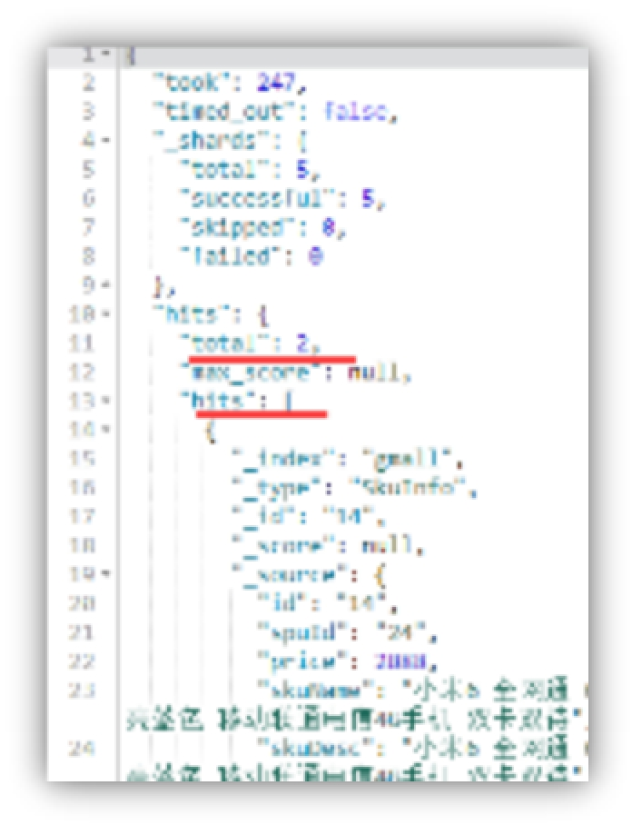 

 

***\*高亮显示\****

 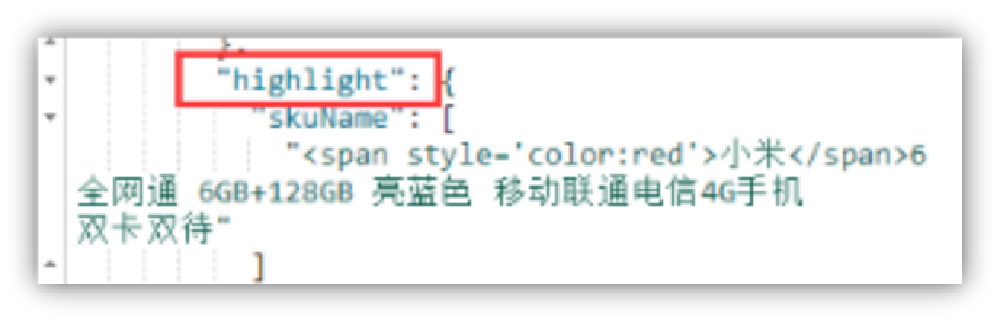

***\*分组统计结果：\****

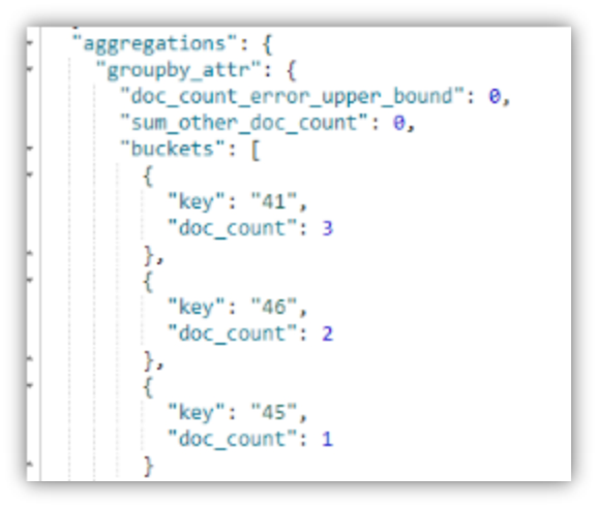 

针对这三个部分来解析searchResult

***\*private\**** SkuLsResult makeResultForSearch(SkuLsParams skuLsParams,SearchResult searchResult){   SkuLsResult skuLsResult=***\*new\**** SkuLsResult();   List<SkuLsInfo> skuLsInfoList=***\*new\**** ArrayList<>(skuLsParams.getPageSize());    **//****获取****sku****列表**** **  List<SearchResult.Hit<SkuLsInfo, Void>> hits = searchResult.getHits(SkuLsInfo.***\*class\****);   ***\*for\**** (SearchResult.Hit<SkuLsInfo, Void> hit : hits) {     SkuLsInfo skuLsInfo = hit.***\*source\****;     ***\*if\****(hit.***\*highlight\****!=***\*null\****&&hit.***\*highlight\****.size()>0){       List<String> list = hit.***\*highlight\****.get(***\*"skuName"\****);       **//****把带有高亮标签的字符串替换****skuName**** **      String skuNameHl = list.get(0);       skuLsInfo.setSkuName(skuNameHl);     }     skuLsInfoList.add(skuLsInfo);   }   skuLsResult.setSkuLsInfoList(skuLsInfoList);   skuLsResult.setTotal(searchResult.getTotal());    **//****取记录个数并计算出总页数**** **  ***\*long\**** totalPage= (searchResult.getTotal() + skuLsParams.getPageSize() -1) / skuLsParams.getPageSize();   skuLsResult.setTotalPages(  totalPage);    **//****取出涉及的属性值****id**** **  List<String> attrValueIdList=***\*new\**** ArrayList<>();   MetricAggregation aggregations = searchResult.getAggregations();   TermsAggregation groupby_attr = aggregations.getTermsAggregation(***\*"groupby_attr"\****);   ***\*if\****(groupby_attr!=***\*null\****){     List<TermsAggregation.Entry> buckets = groupby_attr.getBuckets();     ***\*for\**** (TermsAggregation.Entry bucket : buckets) {       attrValueIdList.add( bucket.getKey()) ;     }     skuLsResult.setAttrValueIdList(attrValueIdList);   }     ***\*return\**** skuLsResult; } 

 

测试后台程序…

完成了sku列表数据获取的方法。回到页面功能上来。

  

  

 

 

 

 

 

 

 

 

 

 

 

 

 

 

 

## ***\*5 检索的页面\****

检索功能

 

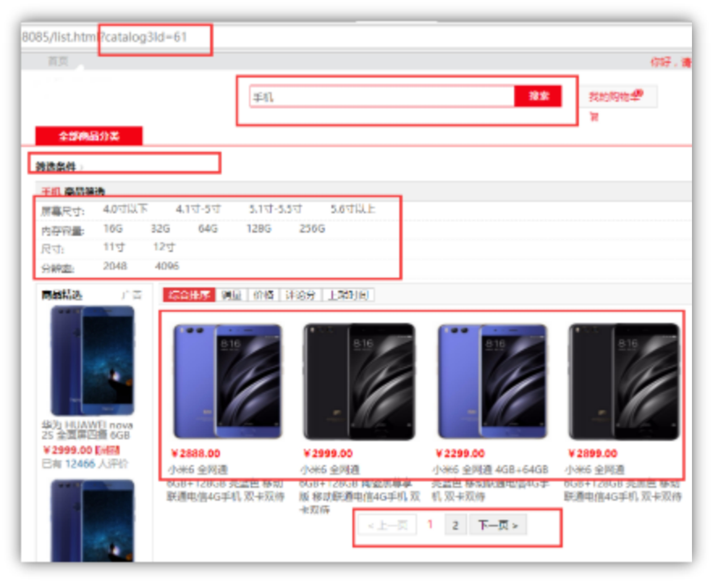 

 

### ***\*5.1 创建gmall-list-\*******\*web\*******\*模块\****

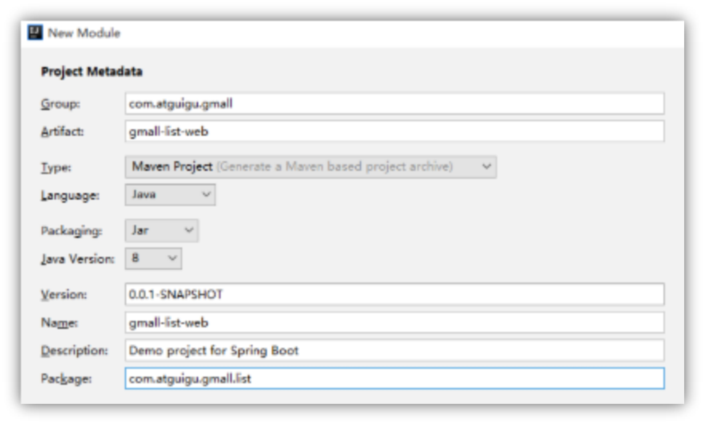 

 

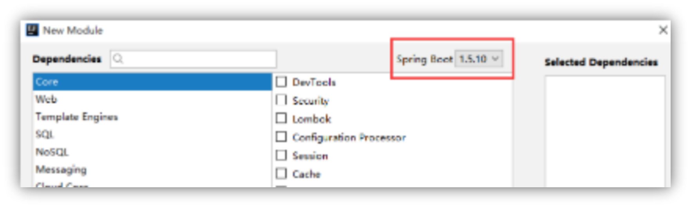 

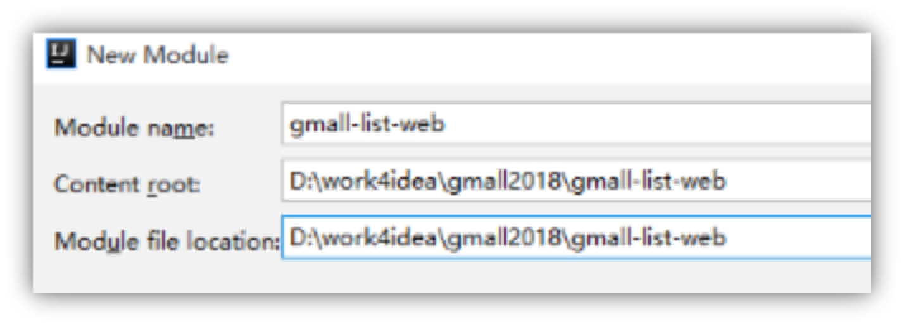 

 

 

#### ***\*5.1.1\**** ***\*pom.xml\****

<***\*parent\****>   <***\*groupId\****>com.atguigu.gmall</***\*groupId\****>   <***\*artifactId\****>gmall-parent</***\*artifactId\****>   <***\*version\****>1.0-SNAPSHOT</***\*version\****> </***\*parent\****>   <***\*dependencies\****>  <***\*dependency\****>   <***\*groupId\****>com.atguigu.gmall</***\*groupId\****>   <***\*artifactId\****>gmall-interface</***\*artifactId\****>   <***\*version\****>1.0-SNAPSHOT</***\*version\****> </***\*dependency\****>  <***\*dependency\****>   <***\*groupId\****>com.atguigu.gmall</***\*groupId\****>   <***\*artifactId\****>gmall-web-util</***\*artifactId\****>   <***\*version\****>1.0-SNAPSHOT</***\*version\****> </***\*dependency\****> </***\*dependencies\****> 

 

#### ***\*5.1.2 静态网页及资源文件\****

拷贝静态文件到resources目录下，手工建立static和templates目录

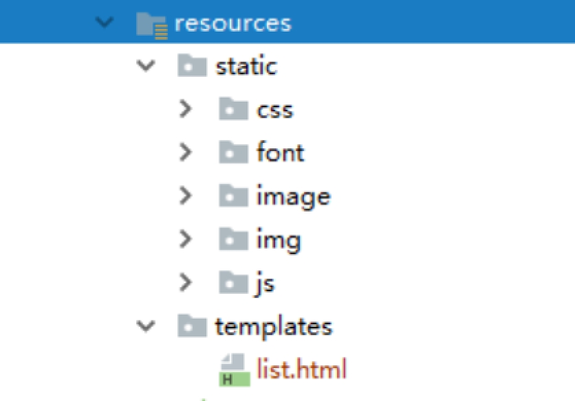 

手工替换一下目录

把list.html的路径中”../static/” 替换成 “/”

#### ***\*5.1.3 application.properties\****

***\*server.port\****=***\*8085\*******\* \*******\* \*******\*spring.thymeleaf.cache\****=***\*false\*******\* \*******\* \*******\*spring.thymeleaf.mode\****=***\*LEGACYHTML5\**** 

 

#### ***\*5.1.4\**** ***\*nginx配置\****

host文件

# gmall192.168.67.163  item.gmall.com list.gmall.com manage.gmall.com  resource.gmall.com  

 

nginx.conf

  upstream list.gmall.com{    server 192.168.67.1:8085;  }  server {   listen 80;   server_name list.gmall.com;   location / {    proxy_pass http:// list.gmall.com;    proxy_set_header X-forwarded-for $proxy_add_x_forwarded_for;   }  }

 

#### ***\*5.1.5 放置nginx首页静态资源\****

用xftp 拷贝首页资源到nginx/gmall目录下

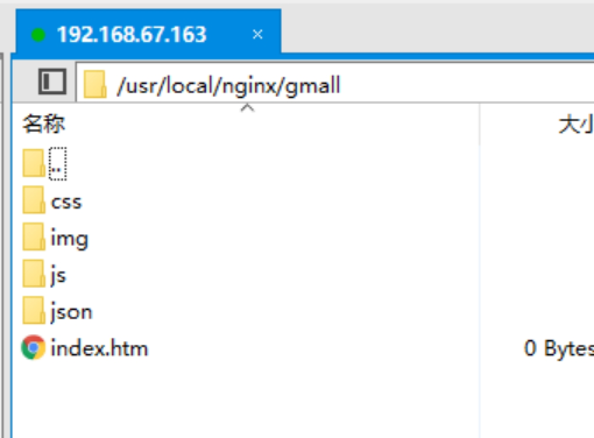 

修改nginx.conf配置文件

 server {    listen    80;    server_name  www.gmall.com;     location / {      root  gmall;      index  index.html index.htm;   } }

host文件

# gmall192.168.67.163  item.gmall.com list.gmall.com manage.gmall.com www.gmall.com resource.gmall.com  

 

 

### ***\*5.2\****  ***\*sku列表功能\****

 

 

首先是根据关键字、属性值、分类Id、页码查询sku列表。

#### ***\*5.2.1 ListController\****

@RequestMapping(***\*"list.html"\****) ***\*public\**** String getList(  SkuLsParams skuLsParams, Model model){    skuLsParams.setPageSize(4);   **//****根据参数返回****sku****列表**** **  SkuLsResult skuLsResult = ***\*listService\****.search(skuLsParams);   model.addAttribute(***\*"skuLsInfoList"\****,skuLsResult.getSkuLsInfoList());  ***\*return\**** ***\*"list"\****;}

 

 

#### ***\*5.2.2 页面html渲染\****

<***\*div\**** ***\*style=\*******\*"\*******\*width\****:215***\*px\*******\*"\**** ***\*th:each="skuLsInfo:${skuLsInfoList}"\**** >    <***\*p\**** ***\*class=\*******\*"da"\****>      <***\*a\**** ***\*href=\*******\*"#"\**** ***\*th:onclick="'javascript:item(\''+${skuLsInfo.id}+'\')'"\****>        <***\*img\**** ***\*th:src="${skuLsInfo.skuDefaultImg}"\****  ***\*src=\*******\*"img/57d0d400Nfd249af4.jpg"\**** ***\*class=\*******\*"dim"\****>      </***\*a\****>    </***\*p\****>     <***\*p\**** ***\*class=\*******\*"tab_R"\****>      <***\*span\**** ***\*th:text="'\*******\*￥\*******\*'+${#numbers.formatDecimal(skuLsInfo.price,1,2)}"\****>¥5199.00</***\*span\****>    </***\*p\****>       <***\*a\**** ***\*href=\*******\*"#"\**** ***\*title=\*******\*""\****  ***\*th:onclick="'javascript:item(\''+${skuLsInfo.id}+'\')'"\**** ***\*class=\*******\*"tab_JE"\**** ***\*th:utext="${skuLsInfo.skuName}"\**** >        Apple iPhone 7 Plus (A1661) 32G 黑色 移动联通电信4G手机      </***\*a\****>  </***\*div\****> 

 

要注意的是其中skuName中因为关键字标签所以必须要用utext否则标签会被转义。

#### ***\*5.2.3搜索栏相关html\****

**<!--****搜索导航****-->**** **<***\*div\**** ***\*class=\*******\*"header_sous"\****>   <***\*div\**** ***\*class=\*******\*"logo"\****>     <***\*a\**** ***\*href=\*******\*"#"\****><***\*img\**** ***\*src=\*******\*"/image/logo1.jpg"\**** ***\*alt=\*******\*""\****></***\*a\****>   </***\*div\****>   <***\*div\**** ***\*class=\*******\*"header_form"\****>     <***\*input id="keyword" name="keyword" type="text" placeholder="\*******\*手机\*******\*"\**** />     <***\*a href="#" onclick="\******searchList**()***\*"\****>搜索</***\*a\****>   </***\*div\****>   <***\*div\**** ***\*class=\*******\*"header_ico"\****>     <***\*div\**** ***\*class=\*******\*"header_gw"\****>       <***\*span\****><***\*a\**** ***\*href=\*******\*"#"\****>我的购物车</***\*a\****></***\*span\****>       <***\*img\**** ***\*src=\*******\*"/image/settleup-@1x.png"\**** />       <***\*span\****>0</***\*span\****>     </***\*div\****>     <***\*div\**** ***\*class=\*******\*"header_ko"\****>       <***\*p\****>购物车中还没有商品，赶紧选购吧！</***\*p\****>     </***\*div\****>   </***\*div\****> 

#### ***\*5.2.4\**** ***\*js代码\****

 ***\*function\**** **searchList**(){   ***\*var\**** keyword = ***\*$\****(***\*"#keyword"\****).val();   ***\*window\****.***\*location\****.***\*href\****=***\*"/list.html?keyword="\****+keyword; } ***\*function\**** **item**(skuid) {   ***\*window\****.***\*location\****.***\*href\****=***\*"http://item.gmall.com/"\****+skuid+***\*".html"\****; } 

 

这时可以看到列表效果了。

 

### ***\*5.3 页面功能\*******\*—\*******\*提供可供选择的属性列表\****

#### ***\*5.3.1\**** ***\*思路：\****

这个列表有两种情况

1、 如果是通过首页的3级分类点击进入的，要按照分类Id查询对应的属性和属性值列表。

2、 如果是直接用搜索栏输入文字进入的，要根据sku的查询结果涉及的属性值(好在我们已经通过es的聚合取出来了)，再去查询数据库把文字列表显示出来。

#### ***\*5.3.2\****  ***\*Lis\*******\*t\*******\*Controller\****

getList方法中添加

**//****根据查询的结果返回属性和属性值列表**** **List<BaseAttrInfo> attrList=***\*null\****; ***\*if\****(skuLsParams.getCatalog3Id()!=***\*null\****){    attrList = ***\*manageService\****.getAttrList(skuLsParams.getCatalog3Id()); }***\*else\**** {   List<String> attrValueIdList = skuLsResult.getAttrValueIdList();   ***\*if\****(attrValueIdList!=***\*null\****&&attrValueIdList.size()>0){     attrList = ***\*manageService\****.getAttrList(attrValueIdList);   }  }model.addAttribute(***\*"attrList"\****,attrList); 

 

其中***\*manageService\****.getAttrList(String catalog3Id)这个方法我们已经有现成的了。

但是***\*manageService\****.getAttrList(attrValueIdList) 这个方法我们要新添加。

#### ***\*5.3.3 在ManageServiceImpl中增加方法\****

@Override ***\*public\**** List<BaseAttrInfo> getAttrList(List<String> attrValueIdList) {   String attrValueIds = StringUtils.**join**(attrValueIdList.toArray(), ***\*","\****);   List<BaseAttrInfo> baseAttrInfoList = ***\*baseAttrInfoMapper\****.selectAttrInfoListByIds(attrValueIds);   ***\*return\**** baseAttrInfoList;  } 

 

 

#### ***\*5.3.4 BaseAttrInfoMapper.xml\****

**<?**xml version="1.0" encoding="UTF-8"**?>**** **<!DOCTYPE mapper SYSTEM "http://mybatis.org/dtd/mybatis-3-mapper.dtd" **>**** **<mapper namespace="com.atguigu.gmall.manage.mapper.BaseAttrInfoMapper">   <select  id ="selectAttrInfoList" parameterType="long" resultMap="attrInfoMap">     SELECT ba.id,ba.attr_name,ba.catalog3_id,     bv.id value_id ,bv.value_name, bv.attr_id FROM     base_attr_info ba INNER JOIN  base_attr_value bv  ON ba.id =bv.attr_id     where  ba.catalog3_id=#{catalog3Id}   </select>   <resultMap id="attrInfoMap" type="com.atguigu.gmall.bean.BaseAttrInfo" autoMapping="true">     <result property="id" column="id" ></result>     <collection property="attrValueList" ofType="com.atguigu.gmall.bean.BaseAttrValue" autoMapping="true">       <result property="id" column="value_id" ></result>     </collection>   </resultMap>     <select  id ="selectAttrInfoListByIds"  resultMap="attrInfoMap">     SELECT ba.id,ba.attr_name,ba.catalog3_id,     bv.id value_id ,bv.value_name, bv.attr_id FROM     base_attr_info ba INNER JOIN  base_attr_value bv  ON ba.id =bv.attr_id     where  bv.id in (${attrValueIds})   </select> </mapper> 

  

  注意这里面没有用#{}是因为attrValueIds 是两个数字用逗号分开的，所以不能整体套上单引，所以使用${}。

#### ***\*5.3.5\**** ***\*BaseAttrInfoMapper\*******\*.class\****

***\*public interface\**** BaseAttrInfoMapper ***\*extends\**** Mapper<BaseAttrInfo> {    ***\*public\**** List<BaseAttrInfo> selectAttrInfoList(***\*long\**** catalog3Id);    ***\*public\**** List<BaseAttrInfo> selectAttrInfoListByIds(@Param(***\*"attrValueIds"\****) String attrValueIds); } 

此处必须要用@Param注解否则${ }无法识别。

 

#### ***\*5.3.6\**** ***\*点击属性值的链接\****

 getAttrList(List<String> attrValueIdList)方法实现后，还有一个问题就是，点击属性时，要把上次查询的内容也带上，即带上历史参数。

***\*private\**** String  makeUrlParam(String keyword,String catalog3Id,  String[] valueIds,String excludeValueId ){   String url=***\*""\****;   List<String> paramList=***\*new\**** ArrayList<>();   ***\*if\****(keyword!=***\*null\****&&keyword.length()>0){     paramList.add(***\*"keyword="\****+keyword);   }   ***\*if\****(catalog3Id!=***\*null\****){     paramList.add(***\*"catalog3Id="\****+catalog3Id);   }    ***\*if\****(valueIds!=***\*null\****) {     ***\*for\**** (***\*int\**** i = 0; i < valueIds.***\*length\****; i++) {       String valueId = valueIds[i];       ***\*if\**** (!excludeValueId.equals(valueId)) {         paramList.add(***\*"valueId="\**** + valueId) ;       }     }   }    url = StringUtils.**join**(paramList, ***\*"&"\****);   ***\*return\**** url; } 

 

getList方法中增加

**//****历史参数**** **String[] valueIds=skuLsParams.getValueId(); String catalog3Id = skuLsParams.getCatalog3Id(); String keyword=skuLsParams.getKeyword();  String urlParam = makeUrlParam(keyword,catalog3Id, valueIds, ***\*""\****); model.addAttribute(***\*"urlParam"\****,urlParam); 

 

 

 

java部分的代码就完成了。

#### ***\*5.3.7 生成属性列表的html部分\****

<div class="GM_selector">   **<!--****手机商品筛选****-->**** **  <div class="title">     <h3><em>商品筛选</em></h3>    </div>   <div class="GM_nav_logo">      <div class="GM_pre"  th:each="attrInfo:${attrList}">       <div class="sl_key">         <span th:text="${attrInfo.attrName}+':'">属性：</span>       </div>       <div class="sl_value">         <ul>           <li  th:each="attrValue:${attrInfo.attrValueList}"><a th:href="'/list.html?'+${urlParam}+'&valueId='+${attrValue.id}"  th:text="${attrValue.valueName}">属性值</a></li>         </ul>       </div>     </div>   </div> </div> 

 

 

 

完成后

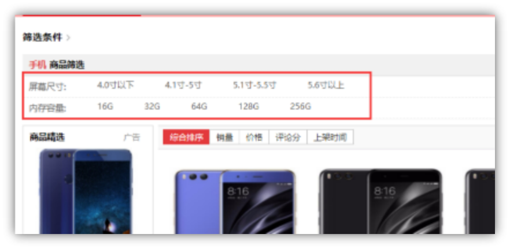 

 

 

 

 

 

 

 

 

### ***\*5.4  页面功能--面包屑\****

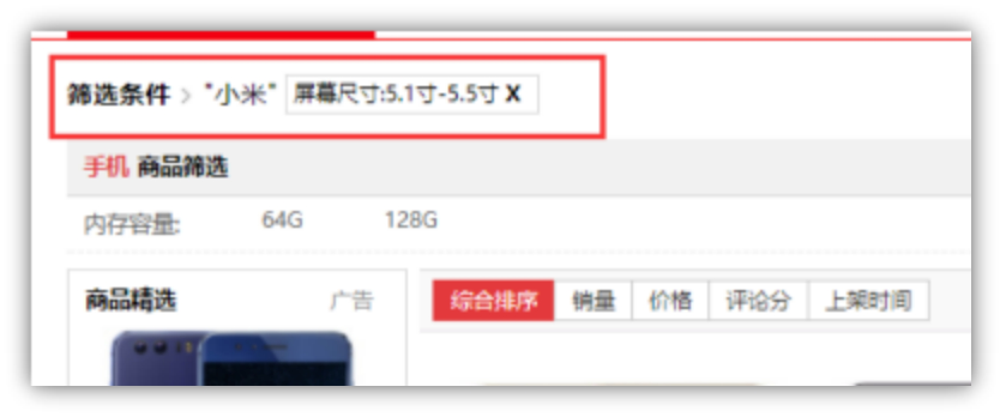 

面包屑导航是为了能够让用户清楚的知道当前页面的所在位置和筛选条件的功能。但是这个小的人性化功能却有点麻烦。

功能点： 1、点击某个属性值的时候对应的那行属性要消失掉不能再次选择。

​     2、列在上面的属性面包屑，要可以取消掉，恢复到没选择之前。

 

#### ***\*5.4.1 思路：\****

1 把本应显示的列表与用户已选择的属性值列表用循环交叉判断，如果匹配把本应显示的那个属性去掉。

2 已选择的属性值列表，要携带点击跳转的路径，这个路径参数就是咱们上边讲的那个“历史参数”，但是要把自己本身的属性值去掉。

 

 

#### ***\*5.4.2 扩展类\****

增加BaseAttrValueExt类 ，这个类是扩展了原BaseAttrValue类为了方便携带参数。

***\*public class\**** BaseAttrValueExt ***\*extends\**** BaseAttrValue {     String ***\*attrName\**** ;    String ***\*cancelUrlParam\****;}

 

 

#### ***\*5.4.3\**** ***\*controller中的getList方法增加\****

代码如下

**//****去掉已选择的属性值**** *****\*if\****(skuLsParams.getValueId()!=***\*null\****&&attrList!=***\*null\****) {   ***\*for\**** (***\*int\**** i = 0; valueIds != ***\*null\**** && i < valueIds.***\*length\****; i++) {     String selectedValueId = valueIds[i];      ***\*for\**** (Iterator<BaseAttrInfo> iterator = attrList.iterator(); iterator.hasNext(); ) {       BaseAttrInfo baseAttrInfo = iterator.next();       List<BaseAttrValue> attrValueList = baseAttrInfo.getAttrValueList();       ***\*for\**** (BaseAttrValue baseAttrValue : attrValueList) {         ***\*if\**** (selectedValueId.equals(baseAttrValue.getId())) {           BaseAttrValueExt baseAttrValueExt = ***\*new\**** BaseAttrValueExt();           baseAttrValueExt.setAttrName(baseAttrInfo.getAttrName());           baseAttrValueExt.setId(baseAttrValue.getId());           baseAttrValueExt.setValueName(baseAttrValue.getValueName());           baseAttrValueExt.setAttrId(baseAttrInfo.getId());           String cancelUrlParam = makeUrlParam(keyword,catalog3Id, valueIds, selectedValueId);           baseAttrValueExt.setCancelUrlParam(cancelUrlParam);            selectedValuelist.add(baseAttrValueExt);            iterator.remove();**//** **如果选中了该属性 就从属性列表中去掉**** **        }       }     }   } }  model.addAttribute(***\*"selectedValueList"\****, selectedValuelist); model.addAttribute(***\*"keyword"\****,keyword); model.addAttribute(***\*"attrList"\****,attrList); 

​	这块代码看似多层循环嵌套性能隐患，其实因为单次循环基本不会超过五次，循环中没有网络或者io访问，完全在虚拟机中运行，所以即使多层循环嵌套压力也不会太大。

#### ***\*5.4.4 页面代码\****

<div class="GM_ipone">   <div class="GM_ipone_bar">     <div class="GM_ipone_one a">       筛选条件         </div>    <i></i>     <span th:if="${keyword}!=null" th:text="'"'+${keyword}+'"'"></span>    <a class="select-attr" th:each="selectedValue:${selectedValueList}"  th:href="'/list.html?'+${selectedValue.cancelUrlParam}"  th:utext="${selectedValue.attrName}+':'+${selectedValue.valueName} +'<b> X </b>'" > 屏幕尺寸:5.1-5.5英寸    </a>    </div> </div> 

 

 

 

 

### ***\*5.5 页面功能--分页\****

  由于咱们在es中查询数据时已经完成了后台分页，这里主要就是把分页结果丢给前台页面展示就好了。

注意每个页面都要带上历史参数。

#### ***\*5.5.1\****  ***\*controller中的getList里加入\****

***\*long\**** totalPages = skuLsResult.getTotalPages(); model.addAttribute(***\*"totalPages"\****,totalPages); model.addAttribute(***\*"pageNo"\****,skuLsParams.getPageNo()); 

 

至此ListController 就全部完成了

#### ***\*5.5\*******\*.2 ListController代码\****

@Controller ***\*public class\**** ListController {    @Reference   ManageService ***\*manageService\****;    @Reference   ListService ***\*listService\****;     @RequestMapping(***\*"list.html"\****)   ***\*public\**** String getList(  SkuLsParams skuLsParams, Model model){       skuLsParams.setPageSize(4);     **//****根据参数返回****sku****列表**** **    SkuLsResult skuLsResult = ***\*listService\****.search(skuLsParams);     model.addAttribute(***\*"skuLsInfoList"\****,skuLsResult.getSkuLsInfoList());      **//****根据查询的结果返回属性和属性值列表**** **    List<BaseAttrInfo> attrList=***\*null\****;     ***\*if\****(skuLsParams.getCatalog3Id()!=***\*null\****){        attrList = ***\*manageService\****.getAttrList(skuLsParams.getCatalog3Id());     }***\*else\**** {       List<String> attrValueIdList = skuLsResult.getAttrValueIdList();       ***\*if\****(attrValueIdList!=***\*null\****&&attrValueIdList.size()>0){         attrList = ***\*manageService\****.getAttrList(attrValueIdList);       }      }     model.addAttribute(***\*"attrList"\****,attrList);      **//****历史参数**** **    String[] valueIds=skuLsParams.getValueId();     String catalog3Id = skuLsParams.getCatalog3Id();     String keyword=skuLsParams.getKeyword();      String urlParam = makeUrlParam(keyword,catalog3Id, valueIds, ***\*""\****);     model.addAttribute(***\*"urlParam"\****,urlParam);      List<BaseAttrValueExt> selectedValuelist =***\*new\**** ArrayList<>();         **//****去掉已选择的属性值**** **    ***\*if\****(skuLsParams.getValueId()!=***\*null\****&&attrList!=***\*null\****) {       ***\*for\**** (***\*int\**** i = 0; valueIds != ***\*null\**** && i < valueIds.***\*length\****; i++) {         String selectedValueId = valueIds[i];          ***\*for\**** (Iterator<BaseAttrInfo> iterator = attrList.iterator(); iterator.hasNext(); ) {           BaseAttrInfo baseAttrInfo = iterator.next();           List<BaseAttrValue> attrValueList = baseAttrInfo.getAttrValueList();           ***\*for\**** (BaseAttrValue baseAttrValue : attrValueList) {             ***\*if\**** (selectedValueId.equals(baseAttrValue.getId())) {               BaseAttrValueExt baseAttrValueExt = ***\*new\**** BaseAttrValueExt();               baseAttrValueExt.setAttrName(baseAttrInfo.getAttrName());               baseAttrValueExt.setId(baseAttrValue.getId());               baseAttrValueExt.setValueName(baseAttrValue.getValueName());               baseAttrValueExt.setAttrId(baseAttrInfo.getId());               String cancelUrlParam = makeUrlParam(keyword,catalog3Id, valueIds, selectedValueId);               baseAttrValueExt.setCancelUrlParam(cancelUrlParam);                selectedValuelist.add(baseAttrValueExt);                iterator.remove();**//** **如果选中了该属性 就从属性列表中去掉**** **            }           }         }       }     }      model.addAttribute(***\*"selectedValueList"\****, selectedValuelist);     model.addAttribute(***\*"keyword"\****,keyword);     model.addAttribute(***\*"attrList"\****,attrList);      ***\*long\**** totalPages = skuLsResult.getTotalPages();     model.addAttribute(***\*"totalPages"\****,totalPages);     model.addAttribute(***\*"pageNo"\****,skuLsParams.getPageNo());      **//****以下是查询商品信息**** **** **** **    ***\*return\**** ***\*"list"\****;   }     ***\*private\**** String  makeUrlParam(String keyword,String catalog3Id,  String[] valueIds,String excludeValueId ){     String url=***\*""\****;     List<String> paramList=***\*new\**** ArrayList<>();     ***\*if\****(keyword!=***\*null\****&&keyword.length()>0){       paramList.add(***\*"keyword="\****+keyword);     }     ***\*if\****(catalog3Id!=***\*null\****){       paramList.add(***\*"catalog3Id="\****+catalog3Id);     }      ***\*if\****(valueIds!=***\*null\****) {       ***\*for\**** (***\*int\**** i = 0; i < valueIds.***\*length\****; i++) {         String valueId = valueIds[i];         ***\*if\**** (!excludeValueId.equals(valueId)) {           paramList.add(***\*"valueId="\**** + valueId) ;         }       }     }      url = StringUtils.**join**(paramList, ***\*"&"\****);     ***\*return\**** url;   } } 

 

 

 

#### ***\*5.5.3 分页的页面部分代码\****

<***\*script\**** ***\*th\*******\*:inline=\*******\*"javascript"\****>   **/\*<![CDATA[\*/**** **** **  ***\*$\****(***\*function\****(){     ***\*$\****(***\*".\*******\*page_span1\*******\*"\****).empty();     ***\*var\**** totalPage = [[${totalPages}]];     ***\*var\**** pageNo = [[${pageNo}]];     ***\*var\**** urlParam = [[${urlParam}]];      **//****上一页**** **    ***\*var\**** $lastPage =  ***\*'<a href="/list.html?'\****+urlParam+***\*'&pageNo='\****+(pageNo-1)+***\*'"><\**** ***\*上一页\*******\*</a>'\****;     ***\*if\****(pageNo == 1){       $lastPage = ***\*'<a disabled="true"><\**** ***\*上一页\*******\*</a>'\****;     }     ***\*$\****(***\*".\*******\*page_span1\*******\*"\****).append($lastPage);     ***\*for\****(***\*var\**** i = 1; i <= totalPage; i++) {       ***\*if\**** (i==pageNo){         ***\*$\****(***\*".\*******\*page_span1\*******\*"\****).append(***\*'<a style="border: 0;font-size: 20px;color: red;background: #fff">'\****+i+***\*'</a>'\****);       }***\*else if\****(i==1 || i==totalPage||(i>=(pageNo-2)&&i<=(pageNo+2))){         ***\*$\****(***\*".\*******\*page_span1\*******\*"\****).append(***\*'<a href="/list.html?'\****+urlParam+***\*'&pageNo='\****+i+***\*'">'\****+i+***\*'</a>'\****);       } ***\*else if\****((i==(pageNo+3) && i<totalPage)||(i==(pageNo-3) && i>1)){         ***\*$\****(***\*".\*******\*page_span1\*******\*"\****).append(***\*'<a style="border: 0;font-size: 20px;color: #999;background: #fff">...</a>'\****);       }     }     **//****下一页**** **    ***\*var\**** $nextPage =  ***\*'<a href="/list.html?'\****+urlParam+***\*'&pageNo='\****+(pageNo+1)+***\*'">\*******\*下一页\**** ***\*></a>'\****;     ***\*if\****(pageNo == totalPage||totalPage==0){       $nextPage = ***\*'<a disabled="true">\*******\*下一页\**** ***\*></a>'\****;     }     ***\*$\****(***\*".\*******\*page_span1\*******\*"\****).append($nextPage);    })   **/\*]]>\*/**** **</***\*script\****> 

分页栏由6部分组成，通过判断页面决定显示效果。

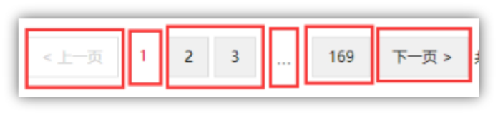 

 

 

 

 

 

 

## ***\*6  排序\****

页面结构完成了，考虑一下如何排序，es查询的dsl语句中我们是用了hotScore来进行排序的。

但是hotScore从何而来，根据业务去定义，也可以扩展更多类型的评分，让用户去选择如何排序。

这里的hotScore我们假定以点击量来决定热度。

那么我们每次用户点击，将这个评分+1,不就可以了么。

### ***\*6.1 问题：\****

1、 es大量的写操作会影响es 性能，因为es需要更新索引，而且es不是内存数据库，会做相应的io操作。

2、而且修改某一个值，在高并发情况下会有冲突，造成更新丢失，需要加锁，而es的乐观锁会恶化性能问题。

从业务角度出发，其实我们为商品进行排序所需要的热度评分，并不需要非常精确，大致能比出个高下就可以了。

利用这个特点我们可以稀释掉大量写操作。

 

### ***\*6.2 解决思路：\****

用redis做精确计数器，redis是内存数据库读写性能都非常快，利用redis的原子性的自增可以解决并发写操作。

 redis每计100次数（可以被100整除）我们就更新一次es ，这样写操作就被稀释了100倍，这个倍数可以根据业务情况灵活设定。

 

代码 在listServiceImpl中增加更新操作

 

 

 

### ***\*6.3 代码：更新es\****

***\*private void\**** updateHotScore(String skuId,Long hotScore){    String updateJson=***\*"{\*******\*\n\*******\*"\**** +        ***\*"\****  ***\*\"\*******\*doc\*******\*\"\*******\*:{\*******\*\n\*******\*"\**** +        ***\*"\****   ***\*\"\*******\*hotScore\*******\*\"\*******\*:"\****+hotScore+***\*"\*******\*\n\*******\*"\**** +        ***\*"  }\*******\*\n\*******\*"\**** +        ***\*"}"\****;    Update update = ***\*new\**** Update.Builder(updateJson).index(***\*"gmall"\****).type(***\*"SkuInfo"\****).id(skuId).build();   ***\*try\**** {     ***\*jestClient\****.execute(update);   } ***\*catch\**** (IOException e) {     e.printStackTrace();   } } 

 

### ***\*6.4 更新redis计数器\****

 **//****更新热度评分**** **@Override ***\*public void\**** incrHotScore(String skuId){   Jedis jedis = ***\*redisUtil\****.getJedis();   ***\*int\**** timesToEs=100;   Double hotScore = jedis.zincrby(***\*"hotScore"\****, 1, ***\*"skuId:"\**** + skuId);   ***\*if\****(hotScore%timesToEs==0){     updateHotScore(  skuId,  Math.**round**(hotScore)  );   }  } 

 

 

 

### 6.5 详情页调用

这个incrHotScore 方法可以在进入详情页面的时候调用。

 

@Controller ***\*public class\**** ItemController {    @Reference   ListService ***\*listService\****;    @Reference   ManageService ***\*manageService\****;    @RequestMapping(***\*"/{skuId}.html"\****)   ***\*public\**** String getSkuInfo(@PathVariable(***\*"skuId"\****) String skuId, Model model){   ……***\*listService\****.incrHotScore(skuId);  **//****最终应该由异步方式调用** }

 

 

 