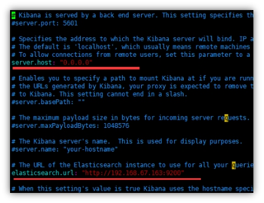

 

# **1** **安装包下载**

Elasticsearch官网： https://www.elastic.co/products/elasticsearch

https://www.elastic.co/downloads/past-releases/elasticsearch-5-6-4

本课程选择的版本是elasticsearch-5.6.4

 

下载好后放到/opt/目录下

 

# **2** **安装elasticsearch**

拷贝elasticsearch-5.6.4.rpm到/opt目录下

 

 

## **2.1** **注册并启动服务**

 

 

CentOS6.8 通过chkconfig --list可以查看

 

 CentOS7.x 可以通过systemctl list-unit-files|grep elasticsearch

 

 

启动之前为elasticsearch配置jdk

vim /etc/sysconfig/elasticsearch 中修改JAVA_HOME路径的路径

 

 

启动elasticsearch

 

查看进程

 

 

 

 

核心文件

/etc/elasticsearch/elasticsearch.yml数据文件路径/var/lib/elasticsearch/日志文件路径e/var/log/elasticsearch/elasticsearch.log

 

 

## **2.2** **修改配置文件**

vim /etc/elasticsearch/elasticsearch.yml

 10.206.0.3

修改yml配置的注意事项:

每行必须顶格，不能有空格

“：”后面必须有一个空格

 

集群名称，同一集群名称必须相同

 

单个节点名称  

 

网络部分  改为当前的ip地址  ，端口号保持默认9200就行

 

把bootstrap自检程序关掉

 

bootstrap.system_call_filter: false

 

自发现配置：新节点向集群报到的主机名

 

 

 

## **2.3** **修改linux配置**

为什么要修改linux配置？

默认elasticsearch是单机访问模式，就是只能自己访问自己。

但是我们之后一定会设置成允许应用服务器通过网络方式访问。这时，elasticsearch就会因为嫌弃单机版的低端默认配置而报错，甚至无法启动。

所以我们在这里就要把服务器的一些限制打开，能支持更多并发。

 

***\*问题\*******\*1\*******\*：\*******\*max file descriptors [4096] for elasticsearch process likely too low, increase to at least [65536] elasticsearch\****

原因：系统允许 Elasticsearch 打开的最大文件数需要修改成65536

解决：vi /etc/security/limits.conf

添加内容：

\* soft nofile 65536

\* hard nofile 131072

\* soft nproc 2048

\* hard nproc 65536

 

注意：“*” 不要省略掉

 

***\*问题\*******\*2\*******\*：\*******\*max number of threads [1024] for user [judy2] likely too low, increase to at least [2048]\****  （CentOS7.x  不用改）

 

原因：允许最大进程数修该成2048

解决：vi /etc/security/limits.d/90-nproc.conf  

修改如下内容：

\* soft nproc 1024

\#修改为

 \* soft nproc 2048

 

***\*问题\*******\*3\*******\*：\*******\*max virtual memory areas vm.max_map_count [65530] likely too low, increase to at least [262144]\**** （CentOS7.x  不用改）

原因：一个进程可以拥有的虚拟内存区域的数量。

解决：可零时提高vm.max_map_count的大小

命令：sysctl -w vm.max_map_count=262144

 

 

## **2.4** **重启linux**  

 

 

## **2.5** **测试**

[root@centos147 ~]# curl http://192.168.67.147:9200{ "name" : "atguigu", "cluster_name" : "my-application", "cluster_uuid" : "dLWGNLJsQ7efpvofNCQLlA", "version" : {  "number" : "5.6.4",  "build_hash" : "8bbedf5",  "build_date" : "2017-10-31T18:55:38.105Z",  "build_snapshot" : false,  "lucene_version" : "6.6.1" }, "tagline" : "You Know, for Search"}

或者直接浏览器访问http://192.168.67.147:9200

 

## **2.6** **如果启动未成功**

如果启动未成功，请去查看相关日志

vim  /var/log/elasticsearch/my-es.log

 

# **3** **安装kibana**

拷贝kibana-5.6.4-linux-x86_64.tar 到/opt下

解压缩

进入kibana主目录的config目录下

 

 

vim  kibana.yml

 

server.host: “你本机ip”

 

启动

 在 kibana主目录bin目录下执行

nohup  ./kibana  &

然后ctrl+c退出

执行ps -ef 

 

如上图,1757号进程就是kibana的进程

 

 

 

用浏览器打开

http://192.168.xx.xx:5601/

 

点击左边菜单DevTools 

在Console中 

执行 get _cluster/health   

右边的结果中，status为yellow或者green。

表示es启动正常，并且与kibana连接正常。