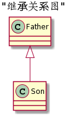
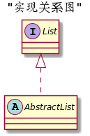
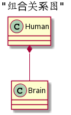
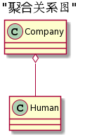
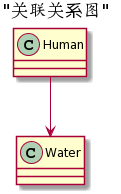
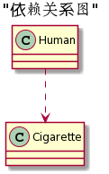

UML类图中主要分为六种关系：泛化(Generalization)、实现(Realization)、关联(Association)、聚合(Aggregation)、组合(Composition)、依赖(Dependency)

各种关系的强弱顺序：

泛化= 实现> 组合> 聚合> 关联> 依赖

- 继承

- 实现

- 组合

关联关系的一种特例，他体现的是一种contains-a的关系，这种关系比聚合更强，也称为强聚合；他同样体现整体与部分间的关系，但此时整体与部分是不可分的，整体的生命周期结束也就意味着部分的生命周期结束。

- 聚合

关联关系的一种特例，他体现的是整体与部分、拥有的关系，即has-a的关系，此时整体与部分之间是可分离的，他们可以具有各自的生命周期。

- 关联

类与类之间的联接。强依赖关系，表现在代码层面，为被关联类B以类属性的形式出现在关联类A中。

- 依赖

类与类之间的联接。一个类A使用到了另一个类B，而这种使用关系是具有偶然性的、临时性的、非常弱的，表现在代码层面，类B作为参数被类A在某个方法中使用，例如人和烟草的关系

